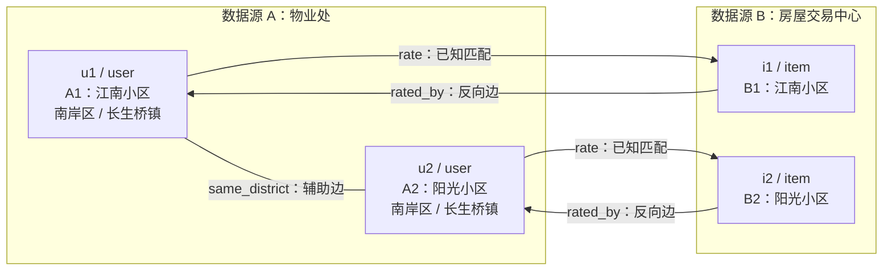

# 三、方法贡献-F2S2G多源表格语义图构造框架
提出一种面向异构政务表格的三阶段语义图构造方法（Field 类型化 → Semantic 向量化 → Graph 异构图化），将传统基于字段相似度的记录匹配问题转化为图上的链接预测问题，并具备跨任务通用性。

## 3.1引言
在住建领域数据治理中，"一套业务两张皮"的核心矛盾在于：物理世界中同一实体（如同一栋房屋、同一个小区），在不同业务单位的信息系统中被独立采集、独立存储，形成了字段异构、命名不一、粒度不同的多源记录。传统实体解析（Entity Resolution, ER）方法通常将该问题建模为"基于字段相似度的分类问题"，对每一对候选记录抽取相似度特征后送入分类器判断是否匹配。然而，这类方法存在三点固有缺陷：

1. **语义信息丢失**：仅使用字段值的字面相似度，忽略了"值属于哪个字段"这一类型信息；
2. **忽略结构关联**：将每一对记录视为独立样本，无法利用"同区县""同物业公司""地理邻近"等跨记录的结构信号；
3. **通用性差**：为每个匹配任务都要重新设计特征工程，难以在不同业务场景之间迁移。

针对上述问题，本章提出一种面向异构政务表格的统一语义图构造框架 F2S2G（Field-to-Semantic-to-Graph），将多源表格通过三阶段映射转化为统一的异构图结构，将记录匹配问题重新形式化为图上的链接预测问题。F2S2G 具备任务无关性——同一套映射流程可同时适配"物业处 ↔ 房屋交易中心"（任务 A）与"征收处 ↔ 奥格科技"（任务 B）两类真实业务场景，仅需在预处理阶段配置任务相关的字段映射规则。


## 3.2问题形式化定义

### 记号说明

设有两个待对齐的数据源 $\mathcal{S}_A$ 与 $\mathcal{S}_B$，分别包含 $n_A$ 与 $n_B$ 条记录：

$$\mathcal{S}_A = \{r_1^A, r_2^A, \dots, r_{n_A}^A\}, \quad \mathcal{S}_B = \{r_1^B, r_2^B, \dots, r_{n_B}^B\}$$

每条记录 $r_i$ 表示为字段-取值对的集合：

$$r_i = \{(f_1, v_1), (f_2, v_2), \dots, (f_{k_i}, v_{k_i})\}$$

其中 $f_j$ 为字段名，$v_j$ 为该字段的取值，$k_i$ 为记录 $i$ 包含的字段数量。

### 跨源实体匹配的图化定义

传统 ER 目标是学习一个分类函数：

$$g: (r_i^A, r_j^B) \rightarrow \{0, 1\}$$

本文将其重新形式化为在异构图 $\mathcal{G} = (\mathcal{V}, \mathcal{E}, \mathcal{T})$ 上的链接预测问题：

- $\mathcal{V} = \mathcal{V}_A \cup \mathcal{V}_B$：每条记录映射为一个节点；
- $\mathcal{E}$：主匹配边与可选源内辅助结构边构成的边集合；
- $\mathcal{T}$：节点类型与边类型集合，至少包含 `rate`（$A \rightarrow B$）与 `rated_by`（$B \rightarrow A$），还可包含按规则生成的辅助关系；
- 每个节点携带初始语义向量 $\mathbf{x}_v \in \mathbb{R}^d$，由 F2S2G 前两阶段生成。

匹配目标转化为：给定图 $\mathcal{G}$ 与部分已知匹配边，学习节点表示 $\mathbf{h}_v$ 使得未观测边 $(v_i^A, v_j^B)$ 的存在概率可通过 $\mathbf{h}_{v_i^A}$ 与 $\mathbf{h}_{v_j^B}$ 的相似度预测。

###  任务隔离约束

为避免不同业务任务的实体在图上错误耦合，引入任务域标识 $\text{dom}(\cdot) \in \{A, B\}$。任务 A（房屋交易业务）与任务 B（外墙面业务）在物理上构建两张独立的异构图 $\mathcal{G}_A$ 与 $\mathcal{G}_B$，共享同一套 F2S2G 映射流程与编码器实现，但 TF-IDF 与 SVD 参数在两个任务上分别拟合，从而在保证任务隔离的同时体现框架的通用性。


## 3.3 F2S2G 框架总览

F2S2G 由三个顺序阶段构成，如图 3-1 所示：

```
┌────────────────────────────────────────────────────────────────────┐
│                     原始多源异构表格                                 │
│          (物业处 / 房屋交易中心 / 征收处 / 奥格科技)                  │
└──────────────────────────────┬─────────────────────────────────────┘
                               │
                    ┌──────────▼───────────┐
                    │  Stage 1: Field 阶段  │  字段类型化与规范化
                    │  ─────────────────   │  · 字段筛选与语义映射
                    │  统一字段体系构建     │  · 取值标准化
                    │  带类型标签的序列化   │  · [键]值 序列化
                    └──────────┬───────────┘
                               │
                    ┌──────────▼───────────┐
                    │ Stage 2: Semantic 阶段│  字符级 n-gram 语义向量化
                    │  ─────────────────   │  · TF-IDF(char, 2-4)
                    │  语义向量化           │  · min_df=2 降噪
                    │                       │  · TruncatedSVD → 32 维
                    └──────────┬───────────┘
                               │
                    ┌──────────▼───────────┐
                    │  Stage 3: Graph 阶段  │  异构图构造
                    │  ─────────────────   │  · 记录→节点
                    │  异构图化             │  · 跨源→ rate/rated_by 边
                    │                       │  · 任务域隔离
                    └──────────┬───────────┘
                               │
                    ┌──────────▼───────────┐
                    │   任务图 G_A / G_B    │  → 下游 GNN 链接预测
                    └──────────────────────┘
```

**图 3-1 F2S2G 三阶段框架总览**

三阶段的核心思想是：**先让字段"说清楚自己是谁"（Field），再让整条记录"变成可比较的向量"（Semantic），最后让所有记录"在图上产生结构关联"（Graph）**。三个阶段功能解耦、可独立替换，便于消融实验与跨任务迁移。

先做数据预处理，丢弃源数据中的系统字段，为每一类字段定义统一的通用的更合理的字段名，将地址标准化，统一空格、全角半角、数字格式，常见别名等（例如把原始数据的“商住一体”“纯住宅”等字段定义为枚举值），数值字段归一表达，比如面积、层数、年份，要用固定格式输出。做好数据融合的前提。

然后把物业处表每行都当作一个 user 实体（比如 [TABLE=物业处] 区县:渝中区 街道:朝天门街道 地址:陕西路9号B幢 层数:35 年份:2001 用途:居住|商业 材料:涂料饰面外墙 面积:5.0 排查:空鼓脱落 结果:严重安全隐患），房屋交易中心表的每行都当做一个 item 实体。这里的 user/item 是沿用推荐系统代码接口的名称，语义上分别表示源 A/源 B 记录节点；两类节点之间的已知匹配关系用 `rate` 和 `rated_by` 两条反向边表示。每一行的实体进行字符串拼接，并带上列名，就相当于映射到一个统一的对象模型，将数据集中的“每行键值对”映射成“节点”，不同表的对应关系映射成边。

然后使用TF-IDF + 字符级 n-gram的方法进行分词，vectorizer = TfidfVectorizer(analyzer="char", ngram_range=(2, 4), min_df=2) 。X=vectorizer.fit_transform(all_texts)  n-gram（2,4）是取 长度为 2 到 4 的字符片段作为特征。min_df=2表示某个 n-gram 至少在 2 条文本中出现过，才会进入特征词表。只出现 1 次的片段会被丢掉（通常是噪声、错别字、极少见门牌号等），作用是降维 + 降噪。最后生成的X 是一个提取完特征的稀疏矩阵向量（CSR 格式）：
行数 = 文本条数（len(all_texts)）
列数 = 特征向量（所有保留下来的 n-gram 个数）
最后用TruncatedSVD 降维到32个维度，当然具体看参数设置。（X的维度会比降维之后要大很多）

最后注意，每个匹配任务会带有匹配表示domin，比如物业处匹配房屋交易中心数据，是任务A，征收处匹配奥格的数据，是任务B，以防止打乱任务。

---

## 3.4 Stage 1：Field 级——字段类型化与语义序列化

###  设计动机

原始表格字段命名存在三类问题：（1）**冗余系统字段**，如 `create_by`、`gmt_create`、`del_flag`、`更新人id`、`附件上传` 等对匹配任务无信息量；（2）**命名不一致**，如同一含义在不同表中被称为 `area_name`、`房屋所属区县`、`区县`；（3）**取值格式不一**，如时间戳既有 `2025-11-05 09:02:02.077170` 也有 `2024/11/7 0:00:00`，面积/层数/年份的数据类型混杂。

若直接对原始字段拼接后送入向量化模型，将引入大量噪声。因此，Field 阶段的目标是：**为每一类字段建立统一的、语义化的规范字段名与取值格式，并以带类型标签的方式序列化整条记录**。

### 字段筛选与统一字段体系

针对两类任务，分别人工定义**匹配相关字段白名单**与**统一字段命名映射表**，将系统字段一律丢弃。

**任务 A：物业处 ↔ 房屋交易中心 字段映射表**

| 统一字段名 | 物业处原字段 | 房屋交易中心原字段 | 说明 |
|-----------|-------------|------------------|------|
| `区县` | `area_name` | `区县` | 行政区划 |
| `街道` | `street_name` | （无） | 街道级地址 |
| `小区名` | `village_name` | `小区名` | 核心匹配字段 |
| `地址` | （无） | `地址` | 详细地址 |
| `物业类型` | `property_type` | `物业类` | 枚举取值 |
| `物业公司` | `company_name` | `物业公` | 公司名 |
| `建设单位` | （无） | `开发单` | 公司名 |
| `建筑面积` | `building_area` | （无） | 数值 |
| `经度` | `lng` | （无） | 数值 |
| `纬度` | `lat` | （无） | 数值 |

**任务 B：征收处 ↔ 奥格科技 字段映射表**

| 统一字段名 | 征收处原字段 | 奥格科技原字段 | 说明 |
|-----------|-------------|--------------|------|
| `区县` | `房屋所属区县` | `房屋所属区县` | 行政区划 |
| `街道` | `房屋所属街道` | （地址中析出） | 街道级 |
| `地址` | `房屋地址` | `房屋详细地址` | 详细地址 |
| `建设单位` | `建设单位` | `建设单位` | 公司名 |
| `管理单位` | `管理单位` | `管理单位` | 物业公司 |
| `层数` | `层数` | `层数` | 数值 |
| `年份` | `建成年份` | `建成年份` | 数值 |
| `用途` | `房屋用途` | `房屋用途` | 多值枚举 |
| `材料` | `材料类别` | （从"外墙约__平方米"字段析出） | 枚举 |
| `面积` | `隐患面积` | `陶瓷砖、保温砂浆、涂料饰面外墙约___平方米` | 数值 |
| `排查情况` | `排查情况` | `排查情况` | 短文本 |
| `排查结果` | `排查结果` | `排查结果` | 枚举 |

### 取值标准化规则

对白名单字段的取值统一执行如下标准化流程：

1. **地址规范化**
   - 去除多余空格（含全角空格）：`"渝中区朝天门 街道陕西路9号B幢"` → `"渝中区朝天门街道陕西路9号B幢"`
   - 全/半角统一为半角：全角数字、括号统一转换
   - 阿拉伯数字规范：`"9号"`、`"9 号"`、`"九号"` → `"9号"`

2. **枚举值归一**
   - 物业类型：`"住宅（商住一体）"`、`"商住一体（综合商业体）"`、`"商住一体"` → `"商住一体"`
   - 排查结果：`"严重安全隐患"`、`"严重隐患"` → `"严重安全隐患"`
   - 建立枚举同义词典 `enum_alias.yaml`，人工维护约 30 条常见别名映射

3. **数值格式**
   - 面积：保留一位小数，如 `38.38` → `"38.4"`，`5.0` → `"5.0"`
   - 层数：整数，`35` → `"35"`
   - 年份：4 位整数 `"2001"`
   - 经纬度：保留 6 位小数

4. **多值字段展开**
   - `房屋用途 = "居住，商业"` → 归一为 `"居住|商业"`（管道符分隔便于 n-gram 感知）

5. **缺失值处理**
   - `NULL`、空字符串、`"未填写"`、字符串 `"null"` 统一映射为特殊 token `<MISSING>`（后续 `min_df=2` 过滤会保证该 token 不会因偶发缺失被抛弃，且不会引入字面误匹配）
   - 若某记录关键字段（如`小区名`或`地址`）完全缺失，则统一保留该记录节点并标记为低质量；当前实现不会因字段缺失而从主图删除它，外部知识查询阶段会在查询名称无效时跳过该节点（详见第 5 章）

6. **时间字段的处理**
   - 由于时间戳字段（`gmt_create`、`创建时间`、`更新时间`、`排查时间`等）对实体是否为"同一物理对象"几乎无信息量，Field 阶段**统一丢弃时间字段**，避免引入伪相似性

7. **公司名规范化**
   - 去除后缀噪声：`"有限公司"`、`"股份有限公司"` 视情况保留（因为它们对区分不同公司仍有意义），但对全角括号、书名号统一半角化
   - 保留原始公司全称，不做过度截断，避免损失区分度

标准化规则以配置文件形式实现（`normalizer.yaml`），保证任务 A、任务 B 使用同一套规则引擎，仅在字段映射表上有差异。

### 带类型标签的语义序列化

在字段筛选与取值标准化完成后，将每条记录 $r_i$ 序列化为一个统一格式的语义字符串 $s_i$。序列化模板如下：

$$s_i = \texttt{[TABLE=<表名>]} \; \texttt{[<字段名>]<取值>} \; \texttt{[<字段名>]<取值>} \; \cdots$$

其中：
- `[TABLE=<表名>]` 标注记录所属的原始数据源，起到**弱类型隔离**作用，让向量化阶段能区分"物业处的江南融府"与"房交中心的江南融府"；
- `[<字段名>]<取值>` 采用带方括号的类型标签前缀，让下游 char n-gram 模型能学到"字段-取值"的组合子串（例如 `[区县]渝中区` 会形成 `[区县`、`区县]`、`县]渝` 等有区分度的 n-gram，而不会与自由文本里出现的"渝中区"混为一谈）；
- 字段之间使用单空格分隔，避免全角/半角空格再次引入噪声。

**任务 A 示例**（物业处一行 → user 实体序列化）：

```
[TABLE=物业处] [区县]南岸区 [街道]长生桥镇 [小区名]江南融府 
[物业类型]商住一体 [建筑面积]38.4 [物业公司]<MISSING>
```

**任务 A 示例**（房屋交易中心一行 → item 实体序列化）：

```
[TABLE=房交中心] [区县]万州区 [地址]上海大道1188号 [小区名]龙湖云熙台 
[物业类型]商住一体 [物业公司]龙湖物业服务集团有限公司 
[建设单位]重庆恒森实业集团有限公司
```

**任务 B 示例**（征收处一行 → user 实体序列化）：

```
[TABLE=征收处] [区县]渝中区 [街道]朝天门街道 [地址]陕西路9号B幢 
[层数]35 [年份]2001 [用途]居住|商业 [材料]涂料饰面外墙 
[面积]5.0 [排查情况]空鼓脱落 [排查结果]严重安全隐患 
[建设单位]基良房地产开发有限公司 [管理单位]重庆基良物业管理有限公司
```

**任务 B 示例**（奥格科技一行 → item 实体序列化）：

```
[TABLE=奥格] [区县]渝中区 [街道]朝天门街道 [地址]陕西路9号B幢 
[层数]35 [年份]2001 [用途]居住|商业 [材料]涂料饰面外墙 
[面积]5.0 [排查情况]空鼓脱落 [排查结果]严重安全隐患 
[建设单位]基良房地产开发有限公司 [管理单位]重庆基良物业管理有限公司
```

可以看到，Field 阶段输出的两条对应记录已在**格式层面高度一致**，仅剩下 `[TABLE=]` 标签与个别缺失字段的差异，这为下一阶段的向量化提供了整洁、可比较的输入。


---

## 3.5 Stage 2：Semantic 级——字符级 n-gram 语义向量化

### 设计动机

政务数据的语言特点决定了 Semantic 阶段的编码策略。中文住建数据具有三点特性：

1. **短文本为主**：单条记录序列化后通常在 50~150 个字符之间，难以支撑基于长上下文的语言模型；
2. **专有名词密集**：小区名、公司名、地址中含大量非通用词汇（如"江南融府""长生桥镇""基良房地产"），词级分词器难以正确切分，且许多罕见名词只出现一次；
3. **格式差异与错别字并存**：全/半角、多余空格、简称/全称混用（"重庆恒森实业集团有限公司" vs "恒森实业"），词级模型对小扰动过于敏感。

基于以上特点，本文选择**字符级 n-gram + TF-IDF** 作为语义编码方案：字符级粒度天然规避中文分词错误；n-gram 能容忍轻微的格式扰动与错别字；TF-IDF 能突出稀有但有区分度的子串。

### 编码流程 

Semantic 阶段的核心任务是将 Stage 1 输出的 $N$ 条序列化文本 $\mathcal{T} = \{s_1, s_2, \dots, s_N\}$ 转换为可供下游 GNN 使用的**固定维度稠密向量**。整个流程沿如下主轴串联执行：

```
    原始文本         →     TfidfVectorizer     →     稀疏高维向量 X      →      TruncatedSVD     →     稠密低维向量 X_reduced
  (N 条字符串)              (Step 1: 向量化)         (中间产物)                (Step 2: 降维)              (最终输出)

  形状: N × 1                                     形状: N × D                                        形状: N × d
  (字符串序列)                                    D ≈ 10^4 ~ 10^5                                    d = 32
  数据类型:文本                                   数据类型:稀疏CSR矩阵                                数据类型:稠密float矩阵
```


#### TfidfVectorizer

N中的一条文本举例为 `str = "[TABLE=物业处] [区县]南岸区 [小区名]江南融府 ..."`，第一步的目标是**把N条文本转成一个高维数值向量**。采用字符级 n-gram TF-IDF 方案，通过 sklearn 的 `TfidfVectorizer` 工具实现：

```python
from sklearn.feature_extraction.text import TfidfVectorizer

vectorizer = TfidfVectorizer(
    analyzer="char",       # 按字符切分,跳过中文分词
    ngram_range=(2, 4),    # 提取长度 2~4 的字符片段作为特征
    min_df=2               # 至少在 2 条文本中出现的 n-gram 才保留
)
X = vectorizer.fit_transform(all_texts)   # 输出稀疏 CSR 矩阵
```

**关键参数的作用**：

- `analyzer="char"`：以字符为最小单位切分，不依赖中文分词工具，天然规避"江南融府"被错误切分的问题；
- `ngram_range=(2, 4)`：同时提取长度为 2、3、4 的字符片段作为特征，例如 `"[区县]渝中区"` 会产生 `"[区"`、`"区县"`、`"县]"`、`"[区县"`、`"区县]"`、`"[区县]"` 等 n-gram；
- `min_df=2`：**承担了第一次降噪**——只在 1 条文本里出现过的 n-gram（错别字、罕见门牌号等噪声）会被直接丢弃，不进入特征词表。


**中间产物：稀疏高维向量 $\mathbf{X}$（形状 $N \times D$）**

$$\mathbf{X} \in \mathbb{R}^{N \times D}$$

- **维度**：$N \times D$
  - 行数 $N$ = 文本条数（记录数量）
  - 列数 $D$ = 保留下来的 n-gram 特征总数，$D \approx 10^4 \sim 10^5$ 量级
- **数据结构**：稀疏 CSR 矩阵（Compressed Sparse Row），只存储非零元素
- **元素含义**：$X_{ij}$ = 记录 $i$ 中 n-gram $j$ 的 TF-IDF 权重（既考虑局部频率，又考虑全局稀有度）

此时数据虽已数值化，但存在两个问题：**（1）维度过高**，直接送入 GNN 会带来巨大的显存和计算开销；**（2）过于稀疏**，高维稀疏空间中的相似度计算不稳定。因此需要 Step 2 进一步压缩。

---

#### TruncatedSVD 
第二步的目标是**把高维稀疏向量压缩到固定的低维稠密向量**：

```python
from sklearn.decomposition import TruncatedSVD

svd = TruncatedSVD(n_components=32, random_state=42)
X_reduced = svd.fit_transform(X)   # 输出稠密矩阵 (N, 32)
```

**这一步做的事**：

- 对 $\mathbf{X}$ 做截断奇异值分解，只保留最大的 $d = 32$ 个奇异值对应的方向（即数据方差最大的 32 个隐语义维度）；
- 相当于对 TF-IDF 空间做**隐语义分析（LSA）**，主要语义方向被保留，次要方向被丢弃——**这是第二次降噪**；
- 维度从 $D$（几万列）骤降到 $d = 32$，且输出变成稠密矩阵，便于 GNN 处理。

**输出端：**
稠密低维向量 $\mathbf{X}^{\text{red}}$（形状 $N \times d$）

$$\mathbf{X}^{\text{red}} \in \mathbb{R}^{N \times 32}$$

- **维度**：$N \times d$，其中 $d = 32$
- **数据结构**：稠密 float 矩阵
- **元素含义**：第 $v$ 行 $\mathbf{x}_v \in \mathbb{R}^{32}$ 就是记录 $v$ 的最终语义向量，将作为图节点 $v$ 的初始特征输入 Stage 3

其中 $d = 32$ 是默认设置（与下游 GNN 的隐藏维度对齐），第 6 章会对 $d \in \{16, 32, 64, 128\}$ 做敏感性分析。

---

### 全局拟合与任务隔离的兼容

一个关键设计：TfidfVectorizer 与 TruncatedSVD **在两个任务上分别独立拟合**，而不是全部数据混合拟合。原因是：

- 任务 A 与任务 B 的字段结构、取值分布差异明显（小区匹配 vs 房屋隐患匹配），混合拟合会稀释各自的语义方向；
- 但**在任务内部**，两源记录（如物业处 + 房屋交易中心）必须**一起拟合**，才能保证同一个 n-gram 在两源之间具有一致的向量方向，这是跨源相似度可比较的前提。

即：
- 任务 A 内：物业处 $\cup$ 房交中心 → 联合拟合 $\text{vectorizer}_A$、$\text{svd}_A$
- 任务 B 内：征收处 $\cup$ 奥格科技 → 联合拟合 $\text{vectorizer}_B$、$\text{svd}_B$

这一策略在保证跨源可比性的同时，实现了**任务级隔离**，也是 F2S2G 支持多任务共存的重要机制。


### 与替代方案的讨论

| 方案 | 优点 | 局限 | 本文取舍 |
|-----|------|------|---------|
| 词级 TF-IDF | 特征更语义化、可解释性好 | 依赖分词质量，专有名词（小区名、公司名）切分差 | 不采用 |
| BERT / SimBERT 编码 | 上下文语义强，捕捉长距离依赖 | 对短结构化文本增益有限，工程复杂度高，训练/推理开销大，难以在稀疏 GPU 资源下大规模复现 | 作为第 6 章对比实验 |
| Sentence-BERT 微调 | 可端到端优化匹配相似度 | 需要大规模标注对做训练，与本文"少量标注 + 图学习"的思路冲突 | 不采用 |
| FastText 字/子词嵌入 | 支持 OOV，训练快 | 需要预训练语料，且对超短结构化文本效果不稳定 | 不采用 |
| **char n-gram + TF-IDF + SVD** | 无需分词、无需预训练、天然容错、可复现 | 缺乏深层语义 | **本文采用** |

**核心权衡**：F2S2G 的定位是"通用的表格→图映射框架"，Semantic 阶段必须满足**低资源、可复现、跨任务稳定**三点要求。char n-gram + TF-IDF + SVD 是在这三项约束下的最优解。同时，Semantic 阶段是可插拔的——第 6 章将验证：即便用 BERT 替换本阶段，F2S2G 整体框架仍然有效，进一步说明 F2S2G 的通用性并不绑定特定编码器。

### Semantic 阶段输出

Semantic 阶段最终输出每条记录的稠密语义向量：

$$\mathbf{x}_v = \text{SVD}(\text{TFIDF}(s_v)) \in \mathbb{R}^{32}$$

该向量将作为图节点 $v$ 的**初始特征**输入到 Stage 3 构造的异构图中，供下游 GNN 进一步聚合邻居信息、学习最终表示。

---

## 3.6 Stage 3：Graph 级——异构图构造

### 设计动机

传统 ER 将每对记录 $(r_i^A, r_j^B)$ 视为独立样本送入分类器，忽略了两类关键的结构信号：

1. **跨源共邻居信号**：如果记录 $r_i^A$ 与多条已知匹配的 $\{r_{j_1}^B, r_{j_2}^B, \dots\}$ 相关联，则新的候选对 $(r_i^A, r_k^B)$ 是否为真匹配，可以从"$r_k^B$ 是否与 $r_{j_1}^B, r_{j_2}^B$ 存在结构相似性"来推断；
2. **源内隐式聚簇信号**：同区县、同物业公司、地理邻近的记录在物理世界中天然聚簇，图上的邻接关系能显式表达这种聚簇。

Graph 阶段的目标就是把 Semantic 阶段输出的孤立节点特征，通过**跨源匹配边**与**源内辅助边**组织成一张异构图，让下游 GNN 通过邻居聚合捕获这些结构信号。

### 构造流程

Graph 阶段沿如下主轴自左至右串联执行，将 Semantic 阶段的稠密特征矩阵最终转化为可供 GNN 训练的异构图对象：

```
    稠密特征矩阵 X_reduced   →    节点集构造     →    节点集 V     →    边集构造      →    边集 E       →    异构图对象 G
      (Semantic 输出)           (Step 1)          (中间产物)         (Step 2)          (中间产物)          (最终输出)

    形状: N × 32                                   |V| = N          主边 + 辅助边      |E| = M            异构图对象
    数据类型:稠密矩阵                              二类节点集合      从标注对与规则     五类关系类别       节点+边+特征+域标
                                                   {user, item}     生成             {rate, rated_by,   task_domain ∈ {A,B}
                                                                                     same_district,
                                                                                     geo_near,
                                                                                     same_company}
```

下面沿这条主轴，依次说明每一段的输入、处理、输出与结构。

---

**输入端：稠密特征矩阵 $\mathbf{X}^{\text{red}}$（形状 $N \times 32$）**

Graph 阶段的输入是 Stage 2 输出的稠密语义特征矩阵：

$$\mathbf{X}^{\text{red}} \in \mathbb{R}^{N \times 32}, \quad N = n_A + n_B$$

- **维度**：$N \times 32$
- **数据结构**：稠密 float 矩阵
- **含义**：每一行 $\mathbf{x}_v \in \mathbb{R}^{32}$ 是记录 $v$ 的语义向量，将挂载为图节点 $v$ 的初始特征

此外，Graph 阶段还接收两类辅助输入：

- **标注匹配对集合** $\mathcal{P} = \{(a_1, b_1), (a_2, b_2), \dots\}$：来自第 4 章 CQ-HouseER 数据集的人工标注 + 主动学习扩展结果，用于构造主匹配边；
- **原始字段索引** $\mathcal{F}$：Stage 1 标准化后的字段值（区县、经纬度、物业公司等），用于构造辅助结构边。

此时数据尚为"孤立的向量 + 一批匹配对记录"，尚未形成图。

---

###  Step 1：节点集构造

第一步的目标是**将 $N$ 条记录映射为异构图中的两类节点**。对每一个任务 $T \in \{A, B\}$，独立构造异构图 $\mathcal{G}_T = (\mathcal{V}_T, \mathcal{E}_T)$。

节点集合按数据源分为两类：

- **user 节点**（源 A 方）：
  - 任务 A：物业处的每一行 → 一个 user 节点，共 $n_A$ 个
  - 任务 B：征收处的每一行 → 一个 user 节点，共 $n_A$ 个
- **item 节点**（源 B 方）：
  - 任务 A：房屋交易中心的每一行 → 一个 item 节点，共 $n_B$ 个
  - 任务 B：奥格科技的每一行 → 一个 item 节点，共 $n_B$ 个

每个节点 $v$ 挂载 Stage 2 输出的 32 维初始特征 $\mathbf{x}_v$。在架构接口中可同时附带
`{task_domain, source_table, record_id}` 等元数据，用于任务隔离与结果回溯；当前纯 PyTorch
`异构图` 容器实际保存的是节点数量、节点特征、边集和边权重，记录元数据由流水线外部的
任务配置与记录列表维护。

> **命名说明**：沿用 `user / item` 是为了与下游 DGRec 等 GNN 骨干的输入接口保持一致，但语义上它们代表"源 A 实体 / 源 B 实体"，与推荐系统的用户/物品无关。在论文行文中将统一称为 **A 类实体节点 / B 类实体节点**。

Step 1 的输出是一个带类型标签、带特征的节点集合$\mathcal{V}$（$|\mathcal{V}| = N$）：

$$\mathcal{V}_T = \mathcal{V}_T^{\text{user}} \cup \mathcal{V}_T^{\text{item}}, \quad |\mathcal{V}_T| = n_A + n_B$$

- **规模**：$|\mathcal{V}_T| = N$
- **类型**：二类异构 $\{\text{user}, \text{item}\}$
- **节点属性**：每个节点携带 32 维初始特征向量；架构上可附带元数据，当前容器不单独存储元数据字段

此时节点已就位，但节点之间尚无连接，需要 Step 2 构造边集。这一步实际上和stage2是同时进行。

---

### Step 2：边集构造

第二步的目标是**在节点之间建立异构边**，让下游 GNN 能通过邻居聚合传递结构信号。边分为两大类：**主匹配边**（用于监督学习与预测目标）和**辅助结构边**（用于提供源内聚簇信号）。文中有时将这两类边简称为“第一类边”和“第二类边”；其中“第二类”不是另一种匹配标签，而是仅用于消息传递的源内结构边。

**（1）主匹配边：`rate` / `rated_by`**

- `('user', 'rate', 'item')`：A 类实体 → B 类实体
- `('item', 'rated_by', 'user')`：B 类实体 → A 类实体

这里的 `user` 和 `item` 是沿用推荐系统代码接口的节点类型名称，并不表示真实的用户和商品：`user` 表示源 A 的记录节点，`item` 表示源 B 的记录节点。若源 A 的记录 (a_i) 与源 B 的记录 (b_j) 已被人工标注或其他标注流程确认属于同一实体，则它们构成一对**已知匹配的跨源节点**，并建立 `rate` 与 `rated_by` 两条反向边：

\[
a_i\;(\text{user}) \xrightarrow{\text{rate}} b_j\;(\text{item}),
\qquad
b_j\;(\text{item}) \xrightarrow{\text{rated\_by}} a_i\;(\text{user}).
\]

正反双向边保证消息传递在两个方向上都可进行。该边集合的来源包括：

- 训练集：人工标注 + 主动学习扩展得到的正样本对 $\mathcal{P}$（详见第 4 章）。

训练时构造的负样本对只用于损失函数中的对比学习，不作为图中的主匹配边写入图结构。

在测试与推理阶段，模型的目标就是预测未观测的 `rate` 边是否存在。

**（2）辅助结构边**

为增强图的结构信号，引入以下三类辅助边（可通过配置开关，供第 6 章消融实验使用）：

| 边类型 | 连接方式 | 语义 | 构造规则 |
|-------|---------|------|---------|
| `same_district` | 同数据源、同节点类型之间 | 行政区划相近 | 若两节点的配置字段取值均相同才建边 |
| `geo_near` | 同数据源、同节点类型之间 | 地理邻近 | 若两节点经纬度距离 < 500m 则建边（当前代码仅在任务 A 的 user 侧构造） |
| `same_company` | 同数据源、同节点类型之间 | 同物业公司/管理单位 | 若两节点配置的公司字段取值相同则建边 |

“同类节点”在这里具体指**同数据源且节点类型相同的节点**：源 A 内部形成 `user-user` 边，源 B 内部形成 `item-item` 边。辅助边不连接 user 与 item，因此不表示跨源匹配，也不作为匹配标签；它们只作为消息传递的通道，为节点提供同区域、地理邻近或同管理单位等结构信息。若辅助边过多导致图极其稠密，则需要构造更严格的规则，否则会影响训练效果。

例如，源 A 中的两条记录 (A_1,A_2) 都属于“南岸区、长生桥镇”，则可建立：

```text
A1(user) --same_district--> A2(user)
A2(user) --same_district--> A1(user)
```

如果两条记录的坐标距离小于 500 米，还可建立 `geo_near` 的双向边。即使如此，A1 与 A2 仍不代表同一个实体；真正的跨源匹配关系应使用 `rate/rated_by` 表示。

下面给出一个最小构图示例。源 A 的两条记录分别映射为 `user` 节点 $u_1,u_2$，源 B
的两条记录分别映射为 `item` 节点 $i_1,i_2$。假设已知匹配对为 $(A_1,B_1)$ 和
$(A_2,B_2)$，且 $A_1,A_2$ 的区县和街道相同：

先列出用于构图的简化记录（实际项目中每条记录还可以包含面积、年份、用途等其他字段）：

| 记录 | 数据源/节点类型 | 小区名 | 区县 | 街道 | 经纬度 |
|------|----------------|--------|------|------|--------|
| A1 | 物业处 / `user` | 江南小区 | 南岸区 | 长生桥镇 | (106.580000, 29.520000) |
| A2 | 物业处 / `user` | 阳光小区 | 南岸区 | 长生桥镇 | (106.581000, 29.521000) |
| B1 | 房屋交易中心 / `item` | 江南小区 | 南岸区 | 长生桥镇 | — |
| B2 | 房屋交易中心 / `item` | 阳光小区 | 渝中区 | 朝天门街道 | — |

其中 A1 与 B1、A2 与 B2 是已知匹配；A1 与 A2 的“区县+街道”字段完全相同，而 B1 与 B2 的字段不同，所以在这个示例中只启用一种辅助关系 `same_district`，并只在 A1、A2 之间建立源内辅助连接。图中一条无向线表示代码中的两条反向有向边。



图中 `rate/rated_by` 是连接两个数据源的主匹配边，`same_district` 是源 A 内部的
辅助边。若在配置中启用 `geo_near` 且两点距离小于 500 米，则还可以在 $u_1,u_2$
之间增加一条 `geo_near` 边；该边仍不表示 $A_1$ 与 $A_2$ 是同一个实体。

**边集构造伪代码（DGL 兼容接口示意，不是当前纯 PyTorch 运行代码）**
```python
def build_edges(records_A, records_B, matched_pairs, task_domain, config):
    # 1. 主匹配边(必选)
    rate_src = [a for a, _ in matched_pairs]
    rate_dst = [b for _, b in matched_pairs]
    graph_data = {
        ('user', 'rate', 'item'):     (rate_src, rate_dst),
        ('item', 'rated_by', 'user'): (rate_dst, rate_src),
    }

    # 2. 辅助结构边(可开关)
    if config.enable_same_district:
        graph_data[('user', 'same_district', 'user')] = build_district_edges(records_A)
        graph_data[('item', 'same_district', 'item')] = build_district_edges(records_B)

    if config.enable_geo_near and task_domain == 'A':
        # 当前实现仅在任务 A 的 user 侧使用地理坐标构造 geo_near 边
        graph_data[('user', 'geo_near', 'user')] = build_geo_edges(records_A, threshold=500)

    if config.enable_same_company:
        graph_data[('user', 'same_company', 'user')] = build_company_edges(records_A)
        graph_data[('item', 'same_company', 'item')] = build_company_edges(records_B)

    return graph_data
```

---

**中间产物：边集 $\mathcal{E}$（$|\mathcal{E}| = M$）**
Step 2 的输出是一个多类型异构边集合：

$$\mathcal{E}_T = \mathcal{E}^{\text{rate}} \cup \mathcal{E}^{\text{rated\_by}} \cup \mathcal{E}^{\text{aux}}$$

其中 $\mathcal{E}^{\text{aux}}$ 包含三类可选辅助边。

- **规模**：$|\mathcal{E}_T| = M$（视辅助边开关而定，通常 $M \gg |\mathcal{P}|$）
- **类型**：关系类别最多 5 类（2 类主边 + 3 类辅助边）；按当前实现展开为具体边类型时最多 7 种（`geo_near` 仅在任务 A 的 user 侧构造）
- **边属性**：无边权重（第 5 章引入外部知识后会补充置信度权重）

此时节点与边均已就位，可组装为异构图对象。当前参考实现使用
`f2s2g/src/f2s2g.py` 中的轻量级纯 PyTorch `异构图` 容器；如果替换下游 GNN，
也可以将同一份节点、边和特征映射为 DGL `HeteroGraph`，但 DGL 并不是当前实现的运行时依赖。

---

### graph阶段输出

Graph 阶段的最终输出是一个可直接送入下游 GNN 的异构图对象 $\mathcal{G}$。当前实现为
纯 PyTorch 自定义容器；下列代码展示的是与 DGL 兼容的接口示意，并不表示当前代码必须依赖 DGL：

```python
def build_hetero_graph(records_A, records_B, matched_pairs, task_domain, config):
    graph_data = build_edges(records_A, records_B, matched_pairs, task_domain, config)

    g = dgl.heterograph(graph_data)
    g.nodes['user'].data['feat'] = torch.tensor(X_reduced_A)   # (n_A, 32)
    g.nodes['item'].data['feat'] = torch.tensor(X_reduced_B)   # (n_B, 32)
    g.task_domain = task_domain
    return g
```

- **结构**：当前为纯 PyTorch `异构图` 容器；架构上可映射为 DGL HeteroGraph
- **节点**：$|\mathcal{V}_T| = n_A + n_B$，二类，每类挂载 $32$ 维初始特征
- **边**：$|\mathcal{E}_T| = M$，关系类别最多 5 类，按当前实现展开为具体有向边类型时最多 7 种
- **域标签**：`task_domain ∈ {A, B}`，用于任务隔离
- **用途**：作为下游 GNN 的输入，第 5 章模型将在其上做链接预测

---


## 3.7 跨任务通用性

F2S2G 的通用性遵循"**引擎统一,配置差异**"的设计原则:同一套代码引擎无差别地
应用于任务 A 与任务 B,任务差异仅通过三个配置文件注入:

1. `field_mapping.yaml`:统一字段体系映射(每任务约 10~15 行)
2. `enum_alias.yaml`:枚举同义词典(可复用,跨任务共享大部分条目)  
3. `graph_config.yaml`:辅助边规则配置(每任务约 5~10 行,声明启用哪些辅助边
   及对应字段)

其中，`graph_config.yaml` 的“声明”是对某个任务的辅助边类型、比较字段和数值阈值
进行配置。例如：

```yaml
task_a:
  edges:
    same_district:
      enabled: true
      match_fields: ["区县", "街道"]
    geo_near:
      enabled: true
      threshold_m: 500
      lng_field: "经度"
      lat_field: "纬度"
    same_company:
      enabled: true
      match_fields: ["物业公司"]
```

上例中的 `lng_field`、`lat_field` 是图规则接口中用于说明坐标字段的可选声明。当前
`f2s2g.py` 实际从 `field_mapping_a.yaml` 的“经度”“纬度”映射读取原始列名；任务 A
房交中心的经纬度映射为空，因此 `geo_near` 只在物业处的 user 节点侧构造。类似地，
`system.yaml` 中的 `graph.geo_near_threshold_m` 是预留的全局参数，当前代码使用
`graph_config.yaml` 对应任务下的 `edges.geo_near.threshold_m`（默认 500 米）。

上述配置表示：任务 A 按统一字段名“区县+街道”尝试构造同区域辅助边，按 500 米距离
阈值构造地理邻近边，并按“物业公司”字段构造同公司辅助边。实际比较时，程序会通过
`field_mapping_a.yaml` 将统一字段名转换为每个数据源的原始列名，并只使用该数据源确实
配置的字段；例如当前任务 A 的房交中心映射没有“街道”列，因此其 `same_district` 分组
实际只按“区县”比较，而物业处侧按“区县+街道”比较。不同任务可以使用不同的字段、阈值
或开关，例如任务 B 可将 `same_company.match_fields` 改为 `["管理单位"]`，并关闭没有
经纬度数据支持的 `geo_near`。程序根据当前任务选择对应配置，图构造引擎本身不需要改写。

任务级规则还需要与数据路径和字段映射关联起来。例如全局配置可以写成：

```yaml
data:
  task_a:
    source_a: "../物业处的目标输出数据：小区基础信息数据.sql"
    source_b: "../房屋交易中心合并数据.csv"
    labels: "../匹配映射.csv"
    field_mapping: "configs/field_mapping_a.yaml"
  task_b:
    source_ab: "../房屋数据合并表格_英文表头是奥格科技的数据_中文表头是征收处数据.xlsx"
    field_mapping: "configs/field_mapping_b.yaml"
```

这里的 `graph_config.yaml` 负责声明“怎么建边”，`field_mapping_*.yaml` 负责把统一
字段名（如“区县”“街道”“物业公司”）映射到各数据源的实际列名，`data.task_a` 和
`data.task_b` 负责声明每个任务的数据文件与标签文件路径。`match_fields` 是统一字段
名列表，不表示跨源的两条记录因此匹配；它只决定每个数据源内部如何分组并建立辅助边。
三者共同实现任务切换和流程通用化。

任务级边配置的 `enabled` 与 `system.yaml` 中的全局开关是两层条件：只有两者同时为
`true`，对应辅助边才会在本次运行中实际创建。例如 `graph_config.yaml` 中即使将
`task_a.edges.same_district.enabled` 设为 `true`，若 `system.yaml` 的
`graph.enable_same_district` 仍为 `false`，本次运行也不会生成该边。这样既能保留每个
任务的规则模板，又能在实验或部署时统一关闭某类结构边。

除此之外,Field 阶段的标准化规则库、Semantic 阶段的 char n-gram + TF-IDF + SVD 
向量化流程、Graph 阶段的节点构造与边构造引擎**代码实现完全一致**,无需为新任务
重写任何 Python 代码。经验估计,将 F2S2G 迁移至一个新的政务数据治理任务,配置
工作量约为 1~2 个工作日。

值得说明的是,任务 A 与任务 B 在辅助边可用性上存在差异——任务 A 由于物业处表
包含经纬度字段,可启用 `geo_near` 边;而任务 B 的两源均无经纬度,仅启用
`same_district` 与 `same_company` 两类辅助边。这种"按需启用"的能力
正体现了 F2S2G 配置化设计的优势:框架不假设所有任务字段齐全,而是通过配置声明
让不可用组件自动跳过。

符合工业界惯例：所有号称通用的框架（TensorFlow、PyTorch Lightning、HuggingFace）都是"引擎统一 + 配置驱动"，没人真做到"零配置"。


---

### 组件可插拔性

F2S2G 的三个阶段之间通过**明确定义的数据接口**串联（文本序列 → 稠密向量矩阵 → 异构图对象），阶段内部的具体实现可独立替换而不影响其他阶段。这种松耦合特性使得框架可根据数据规模、算力预算与任务需求灵活适配。各阶段的默认实现与可替换选项如下表所示：

| 阶段 | 默认实现 | 可替换选项 | 替换成本 |
|-----|---------|-----------|---------|
| Field 标准化 | 规则式（yaml 配置驱动） | 基于 LLM 的自动字段对齐、基于 schema matching 的半自动映射 | 需重写标准化引擎 |
| Semantic 编码 | char n-gram + TF-IDF + TruncatedSVD | BERT / SimBERT / Sentence-BERT / FastText 等预训练编码器 | 需重写编码模块，接口保持 $N \times d$ 稠密矩阵 |
| Graph 构造 | 二分主图 + 辅助边（配置化） | 多源多类型图（三源以上）、时序动态图、超图 | 需扩展图 schema 定义 |
| 下游 GNN | LightGCN / DGRec | GAT、R-GCN、HGT 等任意异构 GNN 骨干 | 仅需适配异构图接口；当前容器可映射为 DGL HeteroGraph |

**接口不变原则**：无论如何替换，各阶段之间的接口签名保持不变——Field 阶段输出统一格式的序列化文本、Semantic 阶段输出 $N \times d$ 稠密矩阵、Graph 阶段输出统一的异构图接口对象。这一约束保证了组件替换的边界清晰、代价可控。当前参考实现用纯 PyTorch 容器承载该接口，若下游骨干要求 DGL，可在接口边界做适配。

需要说明的是，"可插拔"指的是**架构上支持替换**，而非"任何替换都免费"。例如将 Semantic 编码器从 TF-IDF+SVD 替换为 BERT，虽然接口一致，但会带来预训练依赖、GPU 显存要求提高、可复现性下降等工程代价，因此本文默认实现选择了轻量方案。第 6 章的消融实验将系统性地验证各组件在本文数据上的替换效果。

---

### 迁移至其他政务数据治理任务的适配指引

F2S2G 遵循"**引擎统一，配置差异**"的迁移原则：所有阶段的核心代码引擎无需修改，任务差异通过配置文件注入。将 F2S2G 迁移至一个新的政务数据治理任务的完整步骤如下：

**Step 1：识别待对齐的两个数据源**  
确认业务上的匹配目标（一对一 / 一对多 / 多对多）、数据规模、可用字段清单，作为后续配置的输入。

**Step 2：编写字段映射配置 `field_mapping.yaml`**  
将两源的原始字段名映射到统一命名空间，剔除系统字段（时间戳、创建人、更新人、附件等对匹配无信息量的字段）。参考模板约 10~15 行。

**Step 3：补充枚举同义词典 `enum_alias.yaml`**  
将新领域的常用枚举取值别名加入词典（如"住宅（商住一体）" / "商住一体"归一），大部分通用条目（区县名、常见公司后缀）可从本文提供的词典中复用。

**Step 4：编写图构造配置 `graph_config.yaml`**  
按新任务的可用字段声明启用哪些辅助边。例如新任务若无经纬度字段则不启用 `geo_near`，若无物业公司字段则不启用 `same_company`。参考模板约 5~10 行。

**Step 5：准备少量标注对**  
作为主匹配边的训练监督。第 4 章 CQ-HouseER 提出的分层采样 + 主动学习标注协议可直接复用，通常 500~2500 条标注对即可支撑训练。

**工作量估计**：Step 2~4 是配置化环节，经验估计**总计 1~2 个工作日**即可完成；Step 5 视人工标注速度约需 1~2 周。**整个迁移过程零 Python 代码改动**——Field 标准化规则库、Semantic 向量化流程、Graph 构造引擎完全复用。

**易被忽略的差异点**：不同任务的辅助边可用性可能不同（如任务 A 有经纬度而任务 B 没有），这类差异通过 `graph_config.yaml` 的"按需启用"机制自然处理，框架不假设所有任务字段齐全，缺失的组件在配置层面自动跳过，无需修改代码。

---

### 与端到端方法比较的优势

近年来端到端的实体解析方法（如 Ditto、DeepMatcher）倾向于用一个大型预训练模型直接建模 $(r_i^A, r_j^B) \rightarrow \{0, 1\}$，形式上更简洁。相较之下，F2S2G 采用"分阶段流水线 + 图结构建模"的思路，在**政务数据治理场景**下具备以下针对性优势：

1. **显式的中间产物，便于工程落地与调试**  
   Field 阶段的标准化输出、Semantic 阶段的向量矩阵、Graph 阶段的图对象均可独立检查、独立评测。当匹配结果出错时，可逐阶段回溯定位问题（是字段没标准化好？向量方向偏了？还是图结构缺边？），符合政务系统对可解释性与可运维性的实际要求。端到端方法则难以定位内部错误来源。

2. **对标注量的低依赖，契合政务标注昂贵的现实**  
   端到端方法通常需要充足的标注对做监督训练，Ditto 在标准数据集上一般依赖数千至上万条标注。而 F2S2G 的 Field 与 Semantic 阶段完全无监督，仅在下游 GNN 训练时使用少量标注（本文约 500~2500 条即可）。这与住建领域"标注需要业务专家、单条标注成本高、长尾严重"的现实高度匹配。

3. **结构信号的显式利用，缓解长尾语义稀疏**  
   端到端方法把跨记录的结构关联（同区县、同物业公司、地理邻近）隐含在文本拼接中，模型能否学到取决于运气与数据量。F2S2G 将这类结构关联**显式建模为图边**，让长尾节点能通过邻居"借用"其他节点的语义信息，这在任务 A 中 84.97% 的 B 类记录仅出现一次的情况下尤为关键（详见第 5 章）。

4. **可复现性强，普通算力可复现全流程**  
   F2S2G 默认实现不依赖任何大规模预训练模型，全流程可在单卡 GPU（甚至 CPU）上跑通，代码与数据一并开源。这与端到端方法动辄依赖 BERT 及以上规模预训练模型形成对比，降低了后续研究者的复现门槛，也符合本文提出 CQ-HouseER 作为公开基准数据集的定位。

**辩证地看**：F2S2G 并不意在全面替代端到端方法，而是针对政务数据治理这一特定场景的痛点（多源异构、标注稀缺、长尾严重、可解释性要求高）给出更贴合的方案。第 6 章将通过与 Ditto、DeepMatcher 等端到端方法的对比实验，进一步验证 F2S2G 在本文数据上的适用性。

---

**改写要点回顾**：

- **3.7.2**：加了"接口不变原则"，并明确指出"可插拔≠免费替换"，避免过度乐观；
- **3.7.3**：把配置文件从 2 个诚实地扩展为 3 个（新增 `graph_config.yaml`），并单独提示"辅助边差异"这个易被忽略的点，回应了你上一轮的质疑；
- **3.7.4**：4 点优势没变，但每一点都强化了"针对政务场景"的限定，并在最后加了辩证声明"不意在全面替代端到端方法"，避免过度贬低对手方法引起审稿人反感。

需要继续检查/重写 3.7 之外的其他小节吗？或者进入第 4 章（CQ-HouseER 数据集）的撰写？

---


# 四、数据贡献-CQ-HouseER 基准数据集
构建了首个面向中文住建领域的多源实体匹配基准数据集。任务 A 包含物业处 8782 条记录、房屋交易中心 3260 条记录和 2709 对标注匹配；任务 B 的合并表包含 28101 行匹配记录，并配套标注规范，为该领域后续研究提供公开评测基础。

奥格高楼数据(跳过英文名行): 79886 行
征收处外墙数据: 28103 行
合并后：28101 行，剩下的都是不能匹配上和奥格标记为废弃的行

房屋交易中心：	3260行
物业处：8782行
（小区名+区县完全一致）的有：2709 对

# 五、方法贡献-长尾场景下的外部知识增强匹配方案
## 5.1 引言

第 3 章提出的 F2S2G 框架已将多源异构表格转化为可供 GNN 学习的异构图，第 4 章构建的 CQ-HouseER 基准数据集为模型训练与评测提供了标注支撑。然而，在真实业务数据上直接套用主流 GNN 骨干进行链接预测，仍面临一个无法回避的现实困难——**长尾问题**。

对当前 CQ-HouseER 任务 A 文件的统计显示：**84.97% 的 B 类实体（2770/3260）的小区名在源数据中仅出现 1 次**。这些"长尾节点"在图上表现为邻居极度稀疏、语义信号单薄、GNN 聚合失效。仅依赖图内部信号的方法（多层聚合、图数据增强、少样本学习等）本质上是"在稀疏的图上做文章"，无法凭空创造出不存在的语义信号。要真正缓解长尾，必须**从图外部引入新的语义信号**。

基于以上观察，本章提出**长尾场景下的外部知识增强匹配方案**。核心思想是：当图内部信号不足以支撑长尾节点的对齐时，从图外部引入结构化知识（POI 数据、行政区划标准库）进行**知识补全**，将补全信息以新节点或边权重的形式**注入 F2S2G 输出的异构图**，形成知识增强图 $\mathcal{G}'$，再由主流 GNN 骨干在其上完成链接预测。

**本章的定位与创新边界**：本章聚焦"如何用外部知识补全图"这一个具体创新点，不涉及 GNN 骨干设计与训练细节。本章的贡献包括三点：

1. **系统分析住建数据长尾问题的成因**，指出图内部方法的局限；
2. **提出触发式外部知识补全策略**，以最小成本对长尾节点进行知识增强；
3. **提出置信度加权的图注入方案**，将外部知识以可解释、可调控的方式融入 F2S2G 异构图，且保持原图结构不变。

---

## 5.2 长尾问题的成因分析

### 5.2.1 长尾分布的量化描述

以 CQ-HouseER 任务 A（物业处 ↔ 房屋交易中心）为例，B 类实体（房屋交易中心记录）的小区名出现频次分布如表 5-1 所示：

| 出现频次 | 记录数 | 占比 |
|---------|-------|-----|
| 1 次 | 2770 | 84.97% |
| 2 次 | 344 | 10.55% |
| 3~5 次 | 132 | 4.05% |
| ≥ 6 次 | 14 | 0.43% |
| **合计** | **3260** | **100%** |

**表 5-1** B 类实体小区名频次分布

这里的“长尾节点”指**关键匹配字段值在当前源数据中出现次数很少的记录节点**，
不是泛指某个低频小区中的全部房屋。任务 A 默认以源 B 的“小区名”为关键字段；若
同一小区名在源 B 中只出现一次，则对应的那条记录节点属于长尾节点。例如：

| 源 B 记录 | 小区名 | 出现次数 | 是否长尾 |
|---------|-------|---------|---------|
| B1 | 江南小区 | 5 | 否 |
| B2 | 阳光小区 | 1 | 是 |

因此，B2 对应的 `item` 节点是长尾节点。按方案约定，频次统计应针对完成字段标准化后的
有效记录进行，脱敏占位值、空值及其他无效值不应被当作真实小区名参与频次统计。当前实现的
默认阈值 `long_tail_threshold=1`，即字段值出现次数不超过 1 次时触发长尾判定；当前代码的
频次统计函数仍会先按原始字段值计数，查询阶段再跳过 `<MISSING>`、`nan` 和 `None`，如需
严格排除无效值应在预处理或统计函数中进一步过滤。任务 B 没有“小区名”时，关键字段按配置
回退为“地址”。

同一小区名在源数据中仅出现 1 次的现象，反映了住建业务数据的**天然稀疏性**——每一栋建筑、每一个小区在物理世界中都是独立个体，不会像电商推荐中的"热门商品"那样被大量重复引用。这与推荐系统中的长尾分布有本质区别：**推荐系统的长尾是"冷启动物品被少量用户交互"，而住建数据的长尾是"物理实体天然唯一"**。

### 5.2.2 长尾问题对 GNN 匹配的三重影响

**影响 1：邻居聚合失效**  
GNN 的核心机制是通过邻居聚合更新节点表示：$\mathbf{h}_v^{(l+1)} = \text{Aggregate}(\{\mathbf{h}_u^{(l)} : u \in \mathcal{N}(v)\})$。若长尾节点 $v$ 的邻居集合 $\mathcal{N}(v)$ 为空（无已知匹配边）或仅含辅助边邻居（信息量弱），聚合结果几乎等同于自身特征 $\mathbf{h}_v^{(0)}$，多层堆叠也无实质增益。

**影响 2：训练信号缺失**  
链接预测的监督信号来自已标注的匹配对。长尾节点在训练集中缺乏匹配边，模型无法通过反向传播学到与其相关的表示——即使增大标注量，长尾节点的覆盖率也难以显著提升（因其物理上就是稀有）。

**影响 3：语义歧义放大**  
长尾节点仅依赖 Semantic 阶段的字符级特征表示，一旦源数据中出现拼写差异、简称与全称混用（如"江南融府" vs "融创·江南融府"），字符级 n-gram 特征就无法在图内部找到"同义节点"进行印证，匹配容易出错。

### 5.2.3 单靠图内部方法为何不够

针对长尾问题，图学习领域已有若干经典策略：
- **多层 GNN 扩大感受野**：期望通过 2~3 跳邻居间接获得信号，但长尾节点的一跳邻居本身就稀疏，多跳只是把稀疏传播得更远；
- **图数据增强**：如 DropEdge、图对比学习——本质上是在已有图上做随机扰动，无法凭空创造出不存在的语义信号；
- **元学习 / 少样本学习**：能一定程度缓解冷启动，但住建数据的长尾是"绝大多数节点都是冷启动"，元学习难以为继。

**核心结论**：住建数据的长尾问题在于**图内部信号本身就不足**，任何"在已有图上做文章"的方法都是杯水车薪。要真正缓解长尾，必须**从图外部引入新的语义信号**——这正是本章方案的立足点。

---

## 5.3 注入流程

本章方案沿如下主轴串联执行，将外部知识补全信息注入 F2S2G 输出的异构图，最终交付一张知识增强图 $\mathcal{G}'$ 给下游 GNN（GNN 骨干与训练细节详见第 6 章）：

```
    F2S2G 异构图 G     →    外部知识查询    →    知识补全信息    →    图注入        →    知识增强图 G'
    (第 3 章输出)         (Step 1: 5.4 节)      (中间产物)        (Step 2: 5.5 节)      (本章输出,交给第 6 章)

    N × 32 特征           POI/行政区划         别名/坐标/           节点/边扩展         N' × 32 特征
    主匹配边 + 辅助边      标准库               置信度               置信度加权          主匹配边 + 辅助边
                                                                                       + 知识节点 + 补全边
```

**两个步骤的分工**：
- **Step 1（外部知识查询，5.4 节）**：对长尾节点调用外部知识源，获取标准化别名、坐标、行政区划编码等补全信息；
- **Step 2（图注入，5.5 节）**：将补全信息以"知识节点 + 置信度加权边"的形式注入原始异构图，形成知识增强图 $\mathcal{G}'$。

下面逐节详述。

---

## 5.4 Step 1：外部知识源与补全策略

### 5.4.1 知识源选型

本章选用两类外部知识源，均具备**公开可获取、覆盖住建领域、可离线快照化**三个特性：

| 知识源 | 覆盖内容 | 用途 | 获取方式 |
|-------|---------|------|---------|
| **高德/百度地图 POI 库** | 小区标准名称、别名、经纬度、所属行政区划 | 补全小区标识 | 通过公开 API 批量查询后离线快照 |
| **国家统计局行政区划标准库** | 全国省/市/区/县/街道的标准编码与名称 | 标准化区县/街道命名 | 官网下载 |

**离线快照说明**：为保证实验可复现性，本文对所有查询结果做**一次性离线快照**（`poi_cache.json`），后续训练与评测均基于快照进行，避免 API 波动影响结果稳定性。快照连同数据集一并公开。这里的快照是方案中的知识库模块接口；当前 `knowledge_enhance.py` 尚未读取独立的 `poi_cache.json`，而是根据查询模式使用百度 API 或离线名称库模拟查询。

### 5.4.2 补全策略：仅对长尾节点触发

外部知识查询有 API 配额与工程成本，且对非长尾节点收益有限。本章采用**触发式补全**策略——不对所有节点无差别查询，仅对满足以下任一条件的 B 类节点 $v$ 触发查询：

- **长尾判据**：关键字段值在源数据中出现次数不超过阈值。任务 A 默认统计“小区名”，任务 B 在没有“小区名”时回退到“地址”；默认 `long_tail_threshold=1`，因此出现 1 次的记录属于长尾节点；
- **字段缺失判据**：关键匹配字段为空、`NULL`、`null`、`None`、`nan`、`未填写` 或标准化后的 `<MISSING>`。若关键字段缺失但仍有可用的备用字段（例如“小区名”缺失而“地址”存在），可用备用字段查询；若用于查询的字段全部缺失，则无法形成有效查询串，应跳过该节点或由任务配置提供其他查询字段；
- **模型置信判据**：节点在初版模型下的最高匹配置信度低于阈值 $\tau_{\text{low}}$，被标记为难以匹配。

上述是方案层面的可配置触发条件。当前代码默认实现的主要触发条件是关键字段低频统计；查询前会跳过空查询名称、`<MISSING>`、`nan` 和 `None`，尚未单独实现基于初版模型置信度的自动触发。

对每个触发查询的节点，按任务可用字段拼接查询串，方案中通常为 `[小区名 + 区县 + 街道]`；缺少某个字段时只使用仍然有效的字段。从 POI 库最多返回 Top-$k$ 个候选，本文默认 $k=3$。候选信息可包含：

- **标准名称**：POI 库中的正式命名（如"融创·江南融府"）；
- **别名列表**：知识库或接口确实提供时记录的同物异名（如"江南融府"、"融府"）；
- **地址、区县、街道等行政字段**：按知识库返回结果的可用字段保存；
- **标准坐标**：经纬度；
- **匹配置信度** $c \in [0, 1]$：由当前实现根据查询名称与 POI 返回名称的编辑距离、包含关系等信息计算（离线模拟模式也采用名称相似度）；若采用其他知识库，可替换为其提供或按其字段计算的置信度。低于阈值 $\tau_{\text{conf}}=0.5$ 的候选直接丢弃，其余候选才进入图注入模块。

当前 `knowledge_enhance.py` 的百度查询实现实际序列化的是名称、地址、区县和经纬度；百度返回结果未提供或代码未单独解析的别名、街道字段不会被凭空补入节点文本。
此外，当前百度调用将名称作为 `query` 参数、将区县作为 `region` 参数，尚未把街道单独拼接进查询字符串；“小区名+区县+街道”是面向任务配置的查询接口约定，若要完全采用该形式需要在查询适配层补充字段拼接。

### 5.4.3 知识不确定性建模

外部知识并非绝对可靠——POI 库自身可能存在过期、错误、多义（同名不同地）等问题。本章不将补全信息作为硬事实注入图，而是**用置信度 $c$ 作为软权重**，让下游 GNN 在聚合时自动权衡"是否相信这条外部知识"。低置信度补全（$c < \tau_{\text{conf}} = 0.5$）直接丢弃，避免噪声污染。

这种"软注入"设计使得外部知识的引入是**可控、可回退**的——即使 POI 库存在少量错误，也不会对图结构造成不可逆的污染。

---

## 5.5 Step 2：图注入——从 $\mathcal{G}$ 到 $\mathcal{G}'$

### 5.5.1 注入方式的选择

外部知识可通过两种方式注入 F2S2G 异构图，各有权衡：

| 注入方式 | 具体做法 | 优点 | 缺点 |
|---------|--------|------|-----|
| **节点扩展** | 每个外部知识条目 → 新增一个"知识节点"，与被补全的原节点建"补全边" | 结构清晰，GNN 可显式聚合外部信号，保持 F2S2G 阶段解耦 | 图规模增大，训练开销上升 |
| **特征增强** | 将别名 / 坐标拼接进原节点的文本，重跑 Semantic 阶段更新特征 | 图规模不变 | 破坏 F2S2G 的阶段解耦，无法区分"内部信号"与"外部信号" |

本章采用**节点扩展方式**——保持 F2S2G 三阶段解耦原则，且让外部知识以显式的图元素形式存在，便于消融实验与错误分析。

### 5.5.2 知识节点与补全边
对每个触发补全的原节点 $v$ 及其 POI 查询返回的 $k$ 个候选，扩展如下结构：

- **新增知识节点** $v^{\text{kn}}_j$（$j = 1, \dots, k$）：
  - 节点类型：`knowledge`
  - 节点建立与特征生成：将 POI 返回的每条候选信息（标准名称，以及接口实际提供的地址、区县、街道、别名、坐标等可用字段）序列化为带字段标签的文本，例如：

    ```text
    [TABLE=POI] [名称]江南小区 [地址]重庆市南岸区长生桥镇
    [区县]南岸区 [经度]106.580000 [纬度]29.520000
    ```

    再按 F2S2G Stage 1~2 的相同流程得到节点特征：

    \[
    \mathbf{x}_{v^{\text{kn}}_j}
    =\operatorname{SVD}\bigl(\operatorname{TFIDF}(s^{\text{POI}}_j)\bigr)
    \in\mathbb{R}^{d}.
    \]

    **复用 F2S2G 编码器（同一个 `TfidfVectorizer` + `TruncatedSVD` 实例），不重新拟合**，保证知识节点与原节点位于同一语义空间中可比较。候选信息最多保留 $k=3$ 条，但低于置信度阈值的候选会先被过滤，因此一个原节点实际新增的 knowledge 节点数可以是 0、1、2 或 3。字段内容以知识库实际返回结果为准；当前百度实现主要写入名称、地址、区县和经纬度，别名或街道只有在接口返回且实现提取时才会进入文本；
- **新增补全边** $(v, \text{completed\_by}, v^{\text{kn}}_j)$：
  - 边类型：`completed_by` / `completes`（图结构上成对存储，表达补全关系的两个方向）；
  - 边权重：置信度 $c_j \in [\tau_{\text{conf}}, 1]$。

因此，若某个待补充节点保留 $r$ 条候选，则新增 $r$ 个 knowledge 节点，并新增 $2r$ 条有向补全边。置信度属于边属性，用来控制外部候选在 GNN 聚合中的影响强度，不直接替代 knowledge 节点的语义特征。

当前 `knowledge_enhance.py` 会把两条方向的边都写入图对象，但 `f2s2g/src/model.py` 的
`_消息传递` 目前只处理 `completed_by`：知识节点的特征被聚合到对应的 item 节点；
`completes` 已保存但尚未在模型中单独执行反向传播。因此，代码当前实现的是“知识节点补充
item”的有效消息方向，真正的双向知识消息传递仍需在模型中增加对 `completes` 的处理。

**关键设计**：知识节点仅与被补全的原节点相连，**知识节点之间不建边**，也不与其他无关的原节点建边。这样保证了外部知识的作用范围严格可控——每个知识节点只影响"它来自哪个查询"的那一个原节点及其邻居的表示。

### 5.5.3 图注入伪代码

```python
def inject_external_knowledge(graph, records, poi_cache, config):
    """
    graph: F2S2G 输出的原始异构图 G
    records: 原节点的 Stage 1 输出(字段值字典)
    poi_cache: 外部 POI 查询快照
    config: 长尾判据阈值、置信度阈值等
    """
    kn_features = []                                       # 知识节点特征
    completed_by_src, completed_by_dst = [], []            # 补全边端点
    completed_by_w = []                                    # 补全边权重

    for node_id, record in records.items():
        # 判断是否触发补全
        if not is_long_tail(node_id, record, config):
            continue

        # 查询 POI 快照
        query_key = f"{record['小区名']}|{record['区县']}|{record['街道']}"
        poi_results = poi_cache.get(query_key, [])[:config.top_k]

        for poi in poi_results:
            if poi['confidence'] < config.tau_conf:
                continue  # 丢弃低置信度补全

            # 用 F2S2G 编码器编码知识节点特征(复用 Stage 1+2)
            kn_text = serialize_poi(poi)
            kn_vec = f2s2g_encoder.encode(kn_text)

            kn_idx = len(kn_features)
            kn_features.append(kn_vec)

            # 建补全边(带置信度权重)
            completed_by_src.append(node_id)
            completed_by_dst.append(kn_idx)
            completed_by_w.append(poi['confidence'])

    # 扩展异构图
    graph_prime = extend_hetero_graph(
        graph,
        new_node_type='knowledge',
        new_node_features=kn_features,
        new_edges={
            ('item', 'completed_by', 'knowledge'): (completed_by_src, completed_by_dst),
            ('knowledge', 'completes', 'item'):    (completed_by_dst, completed_by_src),
        },
        edge_weights=completed_by_w
    )
    return graph_prime
```

### 5.5.4 知识增强图 $\mathcal{G}'$ 的结构

经过 Step 2 图注入后，扩展图 $\mathcal{G}'$ 相比原图 $\mathcal{G}$ 的结构变化如下：

| 维度 | $\mathcal{G}$（原图） | $\mathcal{G}'$（知识增强图） |
|-----|------------------|-------------------------|
| 节点类型 | `user`, `item` | `user`, `item`, **`knowledge`** |
| 节点数量 | $n_A + n_B$ | $n_A + n_B + n_{\text{kn}}$ |
| 边类型（关系类别） | `rate` / `rated_by` / 3 类辅助关系 | 上述 + **`completed_by` / `completes`** |
| 边权重 | 无（0/1 边） | 主边与辅助边无权重，**补全边带置信度权重 $c \in [0.5, 1.0]$** |

上表按语义关系类别计数；如果按当前纯 PyTorch 容器中的具体有向边键计数，原图最多 7 种，知识增强图最多 9 种。

**关键性质**：

1. **原图结构不变**：所有 `user` / `item` 节点及原有边完全保留，$\mathcal{G}'$ 是对 $\mathcal{G}$ 的**增量扩展**而非替换。这保证了外部知识"仅增强、不干扰"——即使全部关闭外部知识增强模块，模型退化为在原始 $\mathcal{G}$ 上运行，行为可预测；
2. **知识节点为辅助角色**：知识节点不作为匹配目标，即预测阶段模型不预测 `(user, ?, knowledge)` 这类边，知识节点仅在 GNN 前向传播中作为长尾节点的"外部邻居"提供补充信号；
3. **置信度显式可见**：补全边的权重 $c$ 显式存储在图对象上，供下游 GNN 在消息传递时使用（具体实现见第 6 章）。这一显式设计也便于错误分析——当某条匹配预测出错时，可回溯是哪个知识节点、以何种置信度参与了聚合。

### 5.5.5 图注入的规模影响

以当前 CQ-HouseER 任务 A 文件为例，外部知识注入前后的图规模可以写成如下形式；其中
$N_k$ 与 $M_k$ 由实际查询返回和置信度过滤结果决定，README 不预先虚构固定实验数值：

| 指标 | $\mathcal{G}$ | $\mathcal{G}'$ | 变化率 |
|-----|-------------|--------------|-------|
| 节点总数 | 12,042（8782+3260） | 12,042 + $N_k$ | $N_k/12,042$ |
| 边总数 | $M$ | $M + M_k$ | $M_k/M$ |
| 长尾节点覆盖率（至少 1 个邻居） | 由原图实际边统计 | 由增强图实际边统计 | 需通过实验测量 |

图注入新增的节点数等于通过置信度过滤后保留的候选数 $N_k$，新增有向边数为 $M_k=2N_k$（每条候选对应 `completed_by` 与 `completes` 两条边）。长尾节点覆盖率取决于 POI 查询是否返回候选以及候选是否达到置信度阈值，当前代码不会保证每个长尾节点都获得外部邻居，应在具体实验中按增强图实际统计。

---

## 5.6 与端到端知识注入方法的讨论

近年来知识图谱增强的表示学习方法（如 KGAT、KGCN）通常将外部知识以"关系三元组"的形式引入，构造统一的大图并端到端训练。相较之下，本章方案在设计上有三点差异：

1. **触发式而非全量补全**：本章仅对长尾节点触发外部查询，对非长尾节点不做补全。这既节省了 API 与工程成本，也避免了知识注入对高频节点表示的干扰；
2. **软权重而非硬融合**：本章通过置信度加权控制外部知识的影响强度，允许模型自适应地"多相信或少相信"某条外部知识；端到端方法通常将外部知识作为等权邻居，鲁棒性较弱；
3. **可插拔而非深度耦合**：本章的知识注入模块完全独立于 F2S2G 前三阶段与下游 GNN，可通过配置一键开关。这与本文一贯的"引擎统一、组件可插拔"设计原则一致。

**辩证地看**：端到端知识注入方法在拥有高质量、大规模知识图谱的场景下（如通用领域推荐）表现优异；而本章方案针对的是"外部知识部分可用、部分噪声、部分缺失"的政务数据治理场景，更强调可控性、可解释性与工程落地性。

---
# 六、模型实现与训练细节

## 6.1 引言

第 3 章的 F2S2G 框架输出异构图 $\mathcal{G}$，第 5 章的外部知识增强方案将其扩展为知识增强图 $\mathcal{G}'$。本章交代在 $\mathcal{G}'$ 上完成链接预测所需的**模型实现与训练细节**。

**本章定位说明**：本章所述内容属于**通用工程实现**，非本文的创新点。GNN 骨干直接采用现有工作 LightGCN[^1]，损失函数、负采样等训练策略也均基于成熟方法。之所以单独成章，是为了保证方法完整性与实验可复现性，并将"通用实现"与前两章的"创新方法"清晰区分。第 7 章的实验将围绕本章模型进行全面评测。

---

## 6.2 模型总体流程
本文直接采用 LightGCN[^1] 作为 GNN 骨干，不做架构改动。选用理由是 LightGCN 参数少、稀疏图上鲁棒、与本文数据规模匹配。
```
    知识增强图 G'      →    LightGCN         →    节点表示 H       →    点积打分       →    匹配预测
    (第 5 章输出)         (6.3 节)             n_A × 32              s(a,b)             Top-K 输出
                          置信度加权            n_B × 32
                          (6.4 节)
```

**训练**：正样本对来自标注集，负样本通过长尾感知采样（6.5.1）构造，损失采用类别平衡的 InfoNCE（6.5.2）。

**推理**：采用两阶段策略（6.6 节）——先用 F2S2G Stage 2 的 TF-IDF 向量粗筛 Top-50 候选，再用 GNN 表示精排。


## 6.3 置信度加权的消息传递

这里采用的邻居聚合公式是图神经网络领域经典的**基于邻接矩阵的对称归一化消息传递公式**，典型使用者包括 GCN 与 LightGCN，并非本文原创。本文借用这一成熟公式，将跨源匹配边、源内辅助边和外部知识补全边统一放入图传播过程，以增强节点的结构信息。

在矩阵形式下，若 $\mathbf A_w$ 表示带边权的邻接矩阵，$\mathbf D$ 表示相应的度矩阵，
则该传播可写为：

$$\mathbf H^{(l+1)}=\mathbf D^{-1/2}\mathbf A_w\mathbf D^{-1/2}\mathbf H^{(l)}.$$

本文使用的是这一经典传播结构；边权 $w_{uv}$ 仅用于让知识补全候选的置信度参与邻居聚合，
并不意味着对该基础 GNN 公式作出原创性改进。

节点的第 0 层表示由 Semantic 阶段输出的初始特征给出：

$$\mathbf{h}_v^{(0)}=\mathbf{x}_v \in \mathbb{R}^{d}.$$

标准 LightGCN 对所有边一视同仁。为让第 5 章的补全边置信度 $c$ 生效，本文在标准传播形式中引入边权重 $w_{uv}$：

$$\mathbf{h}_v^{(l+1)} = \sum_{u \in \mathcal{N}(v)} \frac{w_{uv}}{\sqrt{|\mathcal{N}(v)| \cdot |\mathcal{N}(u)|}} \mathbf{h}_u^{(l)}$$

其中，$|\mathcal N(v)|$ 表示节点 $v$ 的邻居数量（节点度数），$|\mathcal N(u)|$ 表示邻居节点 $u$ 的邻居数量。归一化因子确实是二者乘积开平方后的倒数，即 $1/\sqrt{|\mathcal N(v)|\,|\mathcal N(u)|}$；这里相乘的是两个节点的度数，不是节点编号或节点本身。为避免歧义，本节展示的逐边公式采用**无权邻居计数度数** $d_v=|\mathcal N(v)|$。如果把 $\mathbf A_w$ 作为严格的带权邻接矩阵，则对应的规范写法应改用带权度数 $d_v^w=\sum_u w_{uv}$，分母为 $\sqrt{d_v^w d_u^w}$；二者是两种明确的度数定义，不能在同一个公式中混用。

该公式的计算方向是由第 $l$ 层得到第 $l+1$ 层：先使用邻居节点的上一层表示 $\mathbf h_u^{(l)}$ 聚合出当前节点表示 $\mathbf h_v^{(l+1)}$，再将 $\mathbf h_v^{(l+1)}$ 作为下一层的输入。它不是 GAT 的注意力公式；GAT 的邻居权重由可学习的注意力系数动态计算，而这里的归一化因子由节点度数（邻居数量）和边权重确定。

完成 $L$ 层传播后，LightGCN 将第 0 层至第 $L$ 层的表示按均匀权重融合：

$$\mathbf{h}_v = \frac{1}{L+1}\sum_{l=0}^{L}\mathbf{h}_v^{(l)} \in \mathbb{R}^{d}.$$

因此，聚合公式产生的是节点表示，最终表示 $\mathbf h_v$ 也仍为 $d$ 维；它本身不是匹配置信度。

各类边的权重取值如下：

| 边类型 | $w_{uv}$ |
|-------|---------|
| `rate` / `rated_by` / 各类辅助边 | 1.0 |
| **`completed_by` / `completes`** | **补全边的置信度 $c \in [0.5, 1.0]$** |

**关键点**：在采用完整双端对称归一化的规范实现中，关闭置信度加权（所有 $w=1$）时，模型退化为标准 LightGCN，便于第 7 章做消融对比。当前参考代码的单端归一化和 `completes` 未处理情况见下方实现说明。

**实现说明**：上述为本文方法的规范传播公式。当前纯 PyTorch 参考实现先按边权重聚合消息，再按接收节点的累计（带权）度数平方根做归一化，尚未逐边显式乘上邻居节点 $u$ 的 $1/\sqrt{|\mathcal N(u)|}$ 因子；因此代码实现是该规范公式的单端近似，详见 `f2s2g/src/model.py` 的 `_消息传递`。

---

## 6.4 训练策略

### 6.4.1 长尾感知的负采样

链接预测需为每个正样本对 $(a, b^+)$ 构造负样本对。**均匀随机采样**在长尾场景下的缺陷是：随机采到的负样本多为"跨区县、字面完全不像"的一眼假样本，模型学不到细粒度决策边界。

本文采用**分层负采样**，按难度划分三层并按固定比例采样，正负比控制在 1:4：

| 层级 | 采样规则 | 比例 |
|-----|---------|-----|
| 简单负样本 | 跨区县随机采样 | 40% |
| 中等负样本 | 同区县、不同街道 | 40% |
| 困难负样本 | 同区县 + 同街道 + TF-IDF 相似度 0.3~0.6 | 20% |

困难负样本是长尾场景下模型学到细粒度差异的关键——它们迫使模型不能仅依赖"区县是否相同"这类粗粒度特征做判断。

### 6.4.2 类别平衡的对比学习损失

采用 **InfoNCE 对比损失**并引入类别平衡权重：

$$\mathcal{L} = -\sum_{(a, b^+) \in \mathcal{P}} \alpha_a \log \frac{\exp(s(a, b^+) / \tau)}{\exp(s(a, b^+) / \tau) + \sum_{b^- \in \mathcal{N}^-(a)} \exp(s(a, b^-) / \tau)}$$

其中：
- $s(a, b) = \mathbf{h}_a^\top \mathbf{h}_b$ 为匹配分数；
- $\tau = 0.1$ 为温度系数；
- $\alpha_a$ 为类别平衡权重（Class-Balanced Loss[^2]）：$\alpha_a = \frac{1 - \beta}{1 - \beta^{n_a}}$，$n_a$ 为节点 $a$ 在训练集中的出现次数，$\beta = 0.9999$，使长尾节点获得更高训练权重。

**选用 InfoNCE 的理由**：相比 BPR 每次只对比一正一负，InfoNCE 支持每个正样本对多个负样本的对比，与 6.5.1 的多层负采样天然契合，样本利用率更高。第 7 章将做损失函数消融对比。

---

## 6.5 匹配预测与两阶段推理

**匹配分数与匹配置信度**：给定 A 类节点 $a$ 与 B 类节点 $b$，先计算两个最终节点表示的点积，得到未归一化的匹配分数：

$$s(a, b) = \mathbf{h}_a^\top \mathbf{h}_b.$$

再将匹配分数通过 Sigmoid 函数映射到 $[0,1]$，作为匹配置信度：

$$p(a, b) = \sigma\bigl(s(a,b)\bigr) = \frac{1}{1+e^{-s(a,b)}}.$$

因此，邻居聚合公式用于计算节点的逐层表示，节点表示的点积用于计算匹配分数，Sigmoid 输出才是匹配置信度；前者不是置信度本身。

**实现说明**：上述点积后接 Sigmoid 是方法规范中的置信度输出定义。当前 `f2s2g/src/utils.py` 和 `f2s2g/src/model.py` 的评估代码直接使用原始点积分数进行 Top-K 排序，尚未显式调用 Sigmoid。由于 Sigmoid 是严格单调函数，是否调用它不会改变候选排序；但若需要对外输出 $[0,1]$ 范围的匹配置信度，仍应在输出阶段显式计算 $p(a,b)=\sigma(s(a,b))$。

**两阶段推理**：$\mathcal{V}^{\text{item}}$ 规模较大（本文任务 A 约 8782 条），逐一计算 GNN 表示的相似度开销高。本文采用两阶段推理：

1. **粗筛**：用 F2S2G Stage 2 的 TF-IDF+SVD 向量做余弦相似度，为每个 $a$ 召回 Top-50 候选（$O(n_B) \to O(50)$）；
2. **精排**：仅对 Top-50 候选计算 GNN 表示的匹配分数 $s(a, b)$，再通过 Sigmoid 得到匹配置信度 $p(a,b)$ 并排序，输出 Top-K 匹配结果。

经验上粗筛几乎不损失召回（真实匹配对的 Stage 2 相似度通常远高于 Top-50 阈值），但推理效率提升约 100 倍。详细的效率对比见第 7 章。

当前参考代码已在 `system.yaml` 中保留 `coarse_top_k` 与 `final_top_k` 配置，但 `utils.py` 的评估路径仍直接将每个 user 与全部 item 做点积后取 Top-K，尚未接入 TF-IDF+SVD 余弦粗筛。因此，本节的两阶段推理是目标流程；当前代码实现的是其中的 GNN 点积排序阶段。

---

## 6.6 训练流程与超参数

**端到端训练流程**：

```
for epoch in range(num_epochs):
    for (a, b_pos) in train_pairs:
        b_negs = sample_negatives(a, b_pos, k=4)     # 6.5.1 分层负采样
        H = lightgcn_forward(G_prime)                # 6.3 + 6.4 前向
        loss = infonce_cb_loss(H, a, b_pos, b_negs)  # 6.5.2 损失
        loss.backward()
        optimizer.step()
```

**关键超参数**（本文默认设置，第 7 章会做敏感性分析）：

| 超参数 | 取值 | 说明 |
|-------|------|-----|
| 节点 embedding 维度 $d$ | 32 | 与 F2S2G Stage 2 输出维度对齐 |
| GNN 层数 $L$ | 3 | LightGCN 默认经验值 |
| 温度系数 $\tau$ | 0.1 | InfoNCE 常用值 |
| 类别平衡参数 $\beta$ | 0.9999 | Class-Balanced Loss 推荐值 |
| 正负比例 | 1:4 | 平衡训练效率与决策边界 |
| 优化器 | Adam | 学习率 $10^{-3}$ |
| Batch size | 1024 | 视 GPU 显存调整 |
| 训练轮数 | 200 | 早停,验证集 F1 连续 10 轮不提升则停止 |

---

# 七、实验与分析

## 7.1 全部实验所用的通用设置
- 完全一样的数据集：CQ-HouseER 任务 A + 任务 B
- 一致的评价指标：Precision / Recall / F1 
- 环境与超参数
- 数据划分（按区县分层）

## 7.2 主对比实验


| 方法 | 可能的质疑 | 回答 |
|------|-------------------------|------------------|
| **Jaccard** | "你的方法这么复杂，比最简单的字符串匹配好多少？值得吗？" | "见表 7-1，Full Model 的 F1 比 Jaccard 高 **X 个百分点**，说明简单字符串匹配在长尾场景下失效。" |
| **TF-IDF Cosine** | "你的 F2S2G Stage 2 已经能算 TF-IDF 向量了，直接算余弦相似度不就够了吗？后面的 GNN 和知识增强是不是多此一举？" | "见表 7-1，Full Model 比 TF-IDF Cosine 的 F1 高 **X 个百分点**，证明 GNN 的邻居聚合和外部知识增强带来了纯向量相似度无法获得的收益。" |
| **DeepMatcher** | "现在都用深度学习端到端做 ER 了，为什么不直接用 DeepMatcher/Ditto？" | "见表 7-1，DeepMatcher 在本文数据上 F1 为 X.XX，Full Model 达到 X.XX，说明政务数据的长尾问题不是端到端深度模型能解决的，必须显式引入图结构和外部知识。" |
| **原始 LightGCN** | "你说你的创新是 F2S2G，但如果直接用 LightGCN 建图跑，是不是也能拿到差不多的结果？" | "见表 7-1，原始 LightGCN（不用 F2S2G，不用知识增强）F1 为 X.XX，Full Model 提升至 X.XX，**这个差距就是 F2S2G + 知识增强的净贡献**。" |


**输出**：一张主对比表，两个任务各一张。**这是答辩的门面**。

## 7.3 消融实验总览表

### 7.3.1 消融实验总配置矩阵

下表是 7.3 消融实验的**完整操作清单**——每一行是一次独立的实验运行，每一列是一个可开关的模块。

| 实验编号 | 变体名称 | Field 类型标签 | Semantic SVD | Graph 结构 | same_district | geo_near | same_company | 外部知识补全 | 置信度加权 | 归属小节 |
|---------|---------|:-------------:|:-----------:|:---------:|:-------------------:|:--------:|:------------:|:-----------:|:---------:|---------|
| **E0** | **Full Model（本文）** | ✅ | ✅ | ✅ | ✅ | ✅ | ✅ | ✅ | ✅ | 基准，所有小节共用 |
| E1 | w/o Field 类型标签 | ❌ | ✅ | ✅ | ✅ | ✅ | ✅ | ✅ | ✅ | 7.3.1 |
| E2 | w/o Semantic SVD | ✅ | ❌ | ✅ | ✅ | ✅ | ✅ | ✅ | ✅ | 7.3.1 |
| E3 | w/o Graph 结构 | ✅ | ✅ | ❌ | — | — | — | — | — | 7.3.1 |
| E4 | w/o same_district | ✅ | ✅ | ✅ | ❌ | ✅ | ✅ | ✅ | ✅ | 7.3.2 |
| E5 | w/o geo_near | ✅ | ✅ | ✅ | ✅ | ❌ | ✅ | ✅ | ✅ | 7.3.2（仅任务 A） |
| E6 | w/o same_company | ✅ | ✅ | ✅ | ✅ | ✅ | ❌ | ✅ | ✅ | 7.3.2 |
| E7 | w/o 全部辅助边 | ✅ | ✅ | ✅ | ❌ | ❌ | ❌ | ✅ | ✅ | 7.3.2 |
| E8 | w/o 外部知识补全 | ✅ | ✅ | ✅ | ✅ | ✅ | ✅ | ❌ | — | 7.3.3 |
| E9 | w/o 置信度加权 | ✅ | ✅ | ✅ | ✅ | ✅ | ✅ | ✅ | ❌ | 7.3.3 |

**图例**：✅ = 开启该模块，❌ = 关闭该模块，— = 该模块因上游依赖已被关闭而不适用

---

### 7.3.2 每组消融的对应关系

| 消融小节 | 涉及实验 | 证明的创新点 | 关键对比 |
|---------|---------|-----------|---------|
| 7.3.1 F2S2G 框架消融 | E0 vs E1, E2, E3 | 创新点 1：F2S2G 三阶段设计 | 每关一阶段 F1 掉多少 |
| 7.3.2 辅助边消融 | E0 vs E4, E5, E6, E7 | F2S2G Stage 3 内部细化 | 每类辅助边的边际贡献 |
| 7.3.3 外部知识增强消融 | E0 vs E8, E9 | 创新点 3：外部知识增强 | 长尾子集 F1 的针对性提升 |


## 7.4 GNN 骨干替换实验总览表


**证明"本文方法不依赖特定 GNN 架构"**——把 Full Model 里的 LightGCN 替换成其他主流 GNN 骨干，其他所有配置保持不变，观察性能是否稳定。

**预期结论**：所有骨干在本文方案下都能取得相近的性能，证明 F2S2G + 外部知识增强的**通用性**（骨干无关性）。


| 实验编号 | GNN 骨干 | 骨干特点 | F2S2G | 外部知识增强 | 训练策略 | 其他配置 |
|---------|---------|---------|:-----:|:-----------:|:-------:|--------|
| **B0** | **LightGCN（本文默认）** | 简洁、无非线性、参数少 | ✅ | ✅ | ✅ | 与 Full Model 一致 |
| B1 | DGRec | LightGCN + 层间注意力 | ✅ | ✅ | ✅ | 与 Full Model 一致 |
| B2 | GAT | 邻居注意力聚合 | ✅ | ✅ | ✅ | 与 Full Model 一致 |
| B3 | R-GCN | 关系感知的异构 GNN | ✅ | ✅ | ✅ | 与 Full Model 一致 |

**关键约束**：**只变 GNN 骨干这一个变量**，其他所有开关（F2S2G 三阶段、辅助边、外部知识增强、置信度加权、训练策略）全部保持与 Full Model 一致。


| 骨干 | 核心机制 | 参数量 | 为什么选它 |
|-----|--------|-------|-----------|
| **LightGCN** | 无参聚合 + 均匀层融合 | 极少（仅节点 embedding） | 本文默认骨干，简洁高效 |
| **DGRec** | LightGCN + 可学习的层间注意力 | 少（+ 注意力权重） | 与 LightGCN 同源，验证"注意力是否有用" |
| **GAT** | 邻居注意力加权聚合 | 中（+ 多头注意力矩阵） | 主流 GNN 代表，验证"节点级注意力是否有用" |
| **R-GCN** | 按边类型分别学习变换矩阵 | 较多（每类边一个矩阵） | 专为异构图设计，验证"关系感知是否有用" |

**这四个骨干形成一个"复杂度递增"的阶梯**——从最简单的 LightGCN 到参数最多的 R-GCN。如果实验结果显示所有骨干性能相近，就更能说明"本文方案的收益来自 F2S2G + 知识增强，而不是 GNN 骨干本身"。


## 7.5 长尾专项分析——结果表模板与设计说明

 表 7-7 长尾专项分析（任务 A：物业处 ↔ 房屋交易中心），两个任务各一张表

| 模型 | S_all F1 | S_head F1 | S_mid F1 | S_tail F1 | 长尾-头部差距 | 知识增强长尾提升 |
|------|:--------:|:---------:|:--------:|:---------:|:------------:|:--------------:|
| M0：原始 LightGCN | [TODO] | [TODO] | [TODO] | [TODO] | [TODO] pp | — |
| M1：F2S2G + LightGCN（无知识） | [TODO] | [TODO] | [TODO] | [TODO] | [TODO] pp | — |
| **M2：Full Model（本文）** | **[TODO]** | **[TODO]** | **[TODO]** | **[TODO]** | **[TODO] pp** | **+[TODO] pp** |

**行列这样设计的原因**：


| 行 | 代表的方法 | 存在意义 |
|---|----------|--------|
| **M0：原始 LightGCN** | 只有 GNN，没有 F2S2G、没有知识增强 | **基线锚点**——证明"什么都不加"时长尾表现有多差 |
| **M1：F2S2G + LightGCN（无知识）** | 加了 F2S2G，但没加外部知识增强 | **中间态**——隔离 F2S2G 的贡献与知识增强的贡献 |
| **M2：Full Model（本文）** | F2S2G + 外部知识增强 全开 | **本文方案**——展示完整方案在长尾场景下的表现 |

| 列 | 划分规则 | 存在意义 |
|---|--------|--------|
| **S_all** | 全量测试集 | **对照锚点**——让读者知道"整体表现"是多少 |
| **S_head** | B 类实体出现 ≥ 6 次 | **极端头部**——性能上限,验证模型在"数据充足"时能做多好 |
| **S_mid** | B 类实体出现 2~5 次 | **中间过渡**——展示"从头部到长尾"的性能梯度变化 |
| **S_tail** | B 类实体仅出现 1 次 | **核心焦点**——本节要证明的关键场景,占数据 96.3% |


---
# 附图与附图说明


## 图1 本发明的整体流程示意图

```
        ┌────┐   ┌────┐   ┌────┐
        │ 9  │   │ 10 │   │ 11 │
        └──┬─┘   └──┬─┘   └──┬─┘
           │        │        │
           └────────┼────────┘
                    ┆
                    ┆(虚线:配置输入)
                    ┆
                    ▼
    ┌───┐     ┌───┐     ┌───┐     ┌───┐
    │ 1 │────▶│ 2 │────▶│ 3 │────▶│ 4 │
    └───┘     └───┘     └─┬─┘     └─┬─┘
                          ┆         │──────│
                          ┆         │      │
                          ┆         ▼      │
      ┌────┐              ┆       ┌───┐    │
      │ 12 │─────────────────────▶│ 5 │   │
      └────┘              ┆       └─┬─┘   │
                          ┆         │     │
                          ┆         ▼     │
                          ┆       ┌───┐   │
                          ┆       │ 6 │←──│
                          ┆       └─┬─┘
                          ┆         │
                          ┆         ▼
                          ┆       ┌───┐
                          ┆       │ 7 │
                          ┆       └─┬─┘
                          ┆         │
                          ┆         ▼
                          ┆       ┌───┐
                          ┆┄┄┄┄┄┄▶│ 8 │
                                  └─┬─┘
                                    │
                                    ▼
                              (匹配结果输出)

                        
                         ┌──────────────────────┐  ┌────────────────────────┐  ┌──────────────────────┐
                         │9、字段映射配置文件   │  │10、枚举同义词典配置文件│  │11、图构造配置文件    │
                         └──────────┬───────────┘  └───────────┬────────────┘  └──────────┬───────────┘
                                    │                          │                          │
                                    └───────────────┬──────────┴───────────────┬──────────┘
                                                    │        配置输入（虚线）   │
                                                    └──────────────┬───────────┘
                                                                   ┆
                                                                   ▼
┌──────────────────┐   ┌──────────────────┐   ┌──────────────────┐   ┌──────────────────┐
│1、原始多源表格   │──▶│2、字段类型化模块 │──▶│3、语义向量化模块 │──▶│4、异构图构造模块 │
└──────────────────┘   └──────────────────┘   └────────┬─────────┘   └────────┬─────────┘
                                                        ┆                      │
                                                        ┆                      ▼
┌────────────────────────┐                              ┆            ┌────────────────────┐
│12、外部POI知识库快照   │──────────────────────────────┼───────────▶│5、外部知识查询模块 │
└────────────────────────┘                              ┆            └─────────┬──────────┘
                                                        ┆                      │
                                                        ┆                      ▼
                                                        ┆            ┌────────────────────┐
                                                        ┆            │6、图注入模块       │
                                                        ┆            └─────────┬──────────┘
                                                        ┆                      │
                                                        ┆                      ▼
                                                        ┆            ┌────────────────────┐
                                                        ┆            │7、图神经网络推理模块│
                                                        ┆            └─────────┬──────────┘
                                                        ┆                      │
                                                        ┆                      ▼
                                                        ┆            ┌────────────────────┐
                                                        ┆            │8、匹配结果输出模块 │
                                                        ┆            └────────────────────┘
```

**说明**：实线箭头表示主数据流；虚线箭头表示配置输入或跨阶段调用（模块3向模块8提供原始向量用于粗筛）。模块4 在完成异构图构造后，一方面将图对象直接输出至模块6，另一方面将图中的长尾节点信息输出至模块5 触发外部知识查询。

---

## 图2 本发明的数据流转与中间产物形状变化示意图

```
    ┌──────────┐          ┌──────────┐          ┌──────────┐          ┌──────────┐
    │   T-1    │          │   T-2    │          │   T-3    │          │   T-4    │
    │          │          │          │          │          │          │          │
    │ 表格A    │          │序列化文本 │          │稀疏矩阵X │          │稠密矩阵  │
    │(n_A 行)  │          │          │          │          │          │X_reduced │
    │          │──▶ 2 ──▶│(N 条字符串│──▶3-1──▶│(N × D    │──▶3-2──▶│(N × d    │
    │ 表格B    │          │ 序列)    │          │  维稀疏) │          │  维稠密) │
    │(n_B 行)  │          │          │          │          │          │          │
    └──────────┘          └──────────┘          └──────────┘          └────┬─────┘
                                                                            │
                                                                            ▼ 4
                                                                      ┌──────────┐
                                                                      │   T-5    │
                                                                      │          │
                                                                      │ 异构图G  │
                                                                      │          │
                                                                      │节点数:N  │
                                                                      │边数:M    │
                                                                      │节点类型:2│
                                                                      │关系类别:≤5│
                                                                      │具体类型:≤7│
                                                                      └────┬─────┘
                                                                           │
                                                                           ▼ 5,6
                                                                      ┌──────────┐
                                                                      │   T-6    │
                                                                      │          │
                                                                      │知识增强  │
                                                                      │  图 G'   │
                                                                      │          │
                                                                      │节点数:   │
                                                                      │N + N_k   │
                                                                      │边数:     │
                                                                      │M + M_k   │
                                                                      │节点类型:3│
                                                                      │关系类别:≤7│
                                                                      │具体类型:≤9│
                                                                      └────┬─────┘
                                                                           │
                                                                           ▼ 7,8
                                                                      ┌──────────┐
                                                                      │   T-7    │
                                                                      │          │
                                                                      │匹配对列表│
                                                                      │          │
                                                                      │每条含:   │
                                                                      │· 源A ID  │
                                                                      │· 源B ID  │
                                                                      │· 置信度  │
                                                                      └──────────┘
```

**说明**：本图示出数据在本发明流水线中的形状与结构演变。每个数据结构方框标注了该阶段中间产物的关键维度信息。方框间的箭头上方数字（如"2"、"3-1"、"3-2"、"4"、"5,6"、"7,8"）表示驱动该次形状变化的模块或子单元编号。其中 N = n_A + n_B 表示两源记录总数；D 为字符级 n-gram 特征数（约 10^4 ~ 10^5 量级）；d 为降维后维度（默认取值 32）；N_k 与 M_k 分别为图注入新增的 knowledge 类节点数与补全边数。

---

## 附图标记

**主标记**：

1、原始多源表格；2、字段类型化模块；3、语义向量化模块；4、异构图构造模块；5、外部知识查询模块；6、图注入模块；7、图神经网络推理模块；8、匹配结果输出模块；9、字段映射配置文件；10、枚举同义词典配置文件；11、图构造配置文件；12、外部POI知识库快照。

**子单元补充标记**：

3-1、字符级 n-gram TF-IDF 向量化子单元；3-2、截断奇异值分解降维子单元。

**数据结构补充标记**：

T-1、原始表格数据结构 A表格(A行) B表格(B行)；T-2、序列化文本数据结构（N 条字符串序列）；T-3、稀疏矩阵X（N × D维稀疏矩阵）；T-4、稠密向量矩阵X_reduced（N × d维稠密矩阵,d小于D ）；T-5、异构图G（节点数:N ，边数:M）；T-6、知识增强图G'（节点数:N + N_k ，边数:M + M_k）；T-7、匹配对列表(每条含:源A ID,源B ID,置信度)。

---

## 附图说明

### 图1 附图说明

**原始多源表格1** 由待对齐的两个数据源的记录构成，作为整个系统的输入。

**字段类型化模块2** 位于流水线首端，其输入端连接原始多源表格1，配置输入端连接字段映射配置文件9与枚举同义词典配置文件10。字段类型化模块2 读取字段映射配置文件9与枚举同义词典配置文件10 中的规则，对原始多源表格1 中的字段执行字段筛选、命名统一与取值标准化三项操作，剔除时间戳、创建人标识等对匹配无信息量的系统字段，将不同源表的字段映射到统一命名空间（例如将"area_name"和"房屋所属区县"均映射为"区县"），并将枚举值归一化（例如将"住宅（商住一体）"归一为"商住一体"）。字段类型化模块2 的输出为带类型标签的序列化文本，格式为 "[TABLE=表名] [字段名]取值 [字段名]取值 ..."。

**语义向量化模块3** 位于字段类型化模块2 的下游，其输入端连接字段类型化模块2 的输出端。语义向量化模块3 包含两个串联的子单元：字符级 n-gram TF-IDF 向量化子单元3-1 采用字符级 n-gram TF-IDF 向量化方法，参数设置为 n 取值范围 2 至 4、最小文档频率 min_df 设为 2，将输入的序列化文本转化为高维稀疏矩阵 X，其形状为 N 行 D 列，其中 N 为记录条数，D 为保留的 n-gram 特征数量；截断奇异值分解降维子单元3-2 采用截断奇异值分解（TruncatedSVD）将稀疏矩阵降维至固定维度 d（默认取值 32），输出稠密语义向量矩阵 X_reduced，其形状为 N 行 d 列。语义向量化模块3 的输出为每条记录对应的稠密向量，同时该输出还通过跨阶段调用支路直接传递至匹配结果输出模块8 用于两阶段推理的粗筛环节。

**异构图构造模块4** 位于语义向量化模块3 的下游，其数据输入端连接语义向量化模块3 的输出端，其配置输入端连接图构造配置文件11。异构图构造模块4 将每条记录映射为异构图中的一个节点，源A 的记录映射为 user 类节点，源B 的记录映射为 item 类节点，语义向量化模块3 输出的稠密向量作为节点的初始特征。这里的 user/item 是沿用推荐系统接口的兼容名称，语义上分别表示源 A/source 与源 B/destination 记录。异构图构造模块4 根据图构造配置文件11 的声明构造两类边：主匹配边（`rate` 与 `rated_by` 双向边）连接已知匹配的跨源节点；辅助结构边连接同一数据源内、节点类型相同的节点，包括按配置字段取值相同的 `same_district` 边、距离小于 500 米的 `geo_near` 边（当前代码仅在任务 A 的 user 侧构造）以及按配置公司字段取值相同的 `same_company` 边。辅助边不表示跨源匹配，只作为消息传递通道。异构图构造模块4 的输出为携带初始节点特征的异构图对象 G，一方面直接输出至图注入模块6，另一方面将图中长尾节点的信息传递至外部知识查询模块5。

**外部知识查询模块5** 位于主流水线之外，其输入端连接异构图构造模块4 的节点信息输出端，其知识库输入端连接外部POI知识库快照12。外部知识查询模块5 采用触发式策略，仅对满足长尾判据、字段缺失判据或低置信度判据的 B 类（item）节点触发查询。长尾判据是关键字段值在源数据中的出现次数不超过阈值（默认 1）；字段缺失是关键字段为空、`NULL`、`null`、`None`、`nan`、`未填写` 或标准化后的 `<MISSING>`。方案中的查询串通常由“小区名+区县+街道”拼接，缺少字段时使用仍有效的可用字段；若所有查询字段均缺失，则无法形成有效查询串。当前代码主要实现关键字段低频触发，并在查询名称为空或为 `<MISSING>`、`nan`、`None` 时跳过查询；百度调用实际以名称作为 `query`、区县作为 `region`，尚未单独拼接街道。知识库最多返回 Top-k 候选（默认 k=3），每个候选可包含标准名称、别名、地址、区县、街道、坐标等实际返回字段；当前百度实现主要序列化名称、地址、区县和经纬度，未单独解析别名或街道。匹配置信度 c 的取值范围为 0 至 1，由实现根据查询名称与返回名称的相似度等信息计算；置信度低于阈值 0.5 的候选直接丢弃。外部知识查询模块5 的输出为若干条带置信度的知识补全信息。

**图注入模块6** 位于异构图构造模块4 与图神经网络推理模块7 之间，其第一输入端连接异构图构造模块4 的输出端，其第二输入端连接外部知识查询模块5 的输出端。对每条通过置信度过滤的候选信息，图注入模块6 依次执行三步：①将候选实际返回的标准名称、地址、区县、街道、别名、坐标等可用字段序列化为带字段标签的 POI 文本；②复用语义向量化模块3 中已经拟合的 `TfidfVectorizer` 和 `TruncatedSVD`，将该文本转换为与原节点相同维度的稠密特征向量，不重新拟合编码器；③据此建立一个新的 `knowledge` 类节点，并在待补充原节点与该节点之间建立带置信度权重的 `completed_by` 与 `completes` 双向补全边。一个原节点最多保留 3 个候选，过滤后实际新增 0 至 3 个 knowledge 节点。图注入模块6 的输出为知识增强图 G'，该图相比原图 G 新增了 knowledge 类节点与补全边，原有节点和边完全保留。

**图神经网络推理模块7** 位于图注入模块6 的下游，其输入端连接图注入模块6 的输出端。图神经网络推理模块7 采用轻量图卷积网络（LightGCN）作为骨干。节点以语义向量作为第 0 层表示，按上一层邻居表示逐层计算下一层表示：

$$\mathbf{h}_v^{(l+1)} = \sum_{u \in \mathcal{N}(v)} \frac{w_{uv}}{\sqrt{|\mathcal{N}(v)| \cdot |\mathcal{N}(u)|}} \mathbf{h}_u^{(l)}.$$

该式是 GCN/LightGCN 中经典的基于邻接矩阵的对称归一化消息传递形式，本文借用这一现有机制，并通过 $w_{uv}$ 引入知识补全边置信度，不主张该公式为本文原创。主匹配边与辅助结构边的 $w_{uv}$ 取 1.0，补全边取候选置信度 $c$。完成 $L$ 层传播后，将第 0 层至第 $L$ 层的表示均匀融合，得到最终节点表示 $\mathbf h_v=\frac{1}{L+1}\sum_{l=0}^{L}\mathbf h_v^{(l)}\in\mathbb R^d$。最终表示不是匹配置信度；匹配结果输出模块8 再计算 user/item 最终表示的点积，并通过 Sigmoid 得到匹配置信度。上述为方法规范公式，当前纯 PyTorch 参考实现采用接收节点累计（带权）度数的单端平方根归一化，未逐边显式加入邻居 $u$ 的度数因子，详见 `f2s2g/src/model.py` 的 `_消息传递`。

**匹配结果输出模块8** 位于流水线末端，其第一输入端连接图神经网络推理模块7 的输出端，其第二输入端通过跨阶段调用支路连接语义向量化模块3 的输出端。按方法规范，匹配结果输出模块8 采用两阶段推理策略：第一阶段从语义向量化模块3 读取原始稠密向量，对每个 user 节点计算其与所有 item 节点的余弦相似度，召回 Top-K 候选（默认 K=50）；第二阶段从图神经网络推理模块7 读取节点最终表示向量，先计算原始点积匹配分数 $z(a,b)=\mathbf h_a^\top\mathbf h_b$，再计算 $p(a,b)=\sigma(z(a,b))=1/(1+e^{-z(a,b)})$ 作为匹配置信度，并按该置信度排序输出最终匹配对。完整链路为：初始语义向量 → 多层邻居聚合 → 层间均匀融合 → user/item 点积 → Sigmoid → 匹配置信度。当前参考代码的评估路径直接对全部 item 计算点积并取 Top-K，`coarse_top_k` 和显式 Sigmoid 尚未接入，详见第 6.5 节的实现说明。

**整体工作流程**：原始多源表格1 输入后，先经字段类型化模块2 依据字段映射配置文件9 与枚举同义词典配置文件10 进行字段筛选、命名统一与取值标准化，输出带类型标签的序列化文本；语义向量化模块3 将序列化文本先通过字符级 n-gram TF-IDF 向量化子单元3-1 编码为高维稀疏向量，再通过截断奇异值分解降维子单元3-2 降维为 d 维稠密向量；异构图构造模块4 依据图构造配置文件11 将稠密向量组织为异构图 G，包含 user 与 item 两类节点及主匹配边与三类辅助结构边；外部知识查询模块5 对图 G 中的长尾节点从外部POI知识库快照12 检索补全信息；图注入模块6 将补全信息扩展为 knowledge 类节点并通过带置信度权重的补全边接入原图，形成知识增强图 G'；图神经网络推理模块7 在知识增强图 G' 上执行置信度加权的多层邻居聚合，输出每个节点的最终表示向量；匹配结果输出模块8 通过两阶段推理，先用原始向量粗筛候选、再用节点最终表示精排，最终输出匹配结果。

系统运行过程中，用户可通过修改字段映射配置文件9、枚举同义词典配置文件10、图构造配置文件11 三个配置文件的内容，将本发明应用于不同的政务数据治理任务，无需修改任何模块的代码实现。当需要切换到新的匹配任务时，仅需编写对应的字段映射规则、补充枚举同义词条目、声明启用的辅助边类型，其余模块的处理流程完全复用，从而实现"一次实现、多任务复用"的通用性目标。

---

### 图2 附图说明

图2 示出本发明流水线中数据形状与结构的演变过程，图中共出现七个中间数据结构 T-1 至 T-7，方框间箭头上方的数字标注了驱动该次形状变化的模块或子单元编号。

**原始表格数据结构 T-1**：由源A 表格（含 n_A 行记录）与源B 表格（含 n_B 行记录）构成，是字段类型化模块2 的输入。

**序列化文本数据结构 T-2**：由字段类型化模块2 对 T-1 处理后输出，形式为 N 条带类型标签的字符串序列，其中 N = n_A + n_B。每条字符串格式为 "[TABLE=表名] [字段名]取值 [字段名]取值 ..."。

**稀疏矩阵数据结构 T-3**：由字符级 n-gram TF-IDF 向量化子单元3-1 对 T-2 处理后输出，形状为 N 行 D 列的稀疏矩阵 X，其中 D 为保留的 n-gram 特征数量，取值范围约在 10^4 至 10^5 量级，采用压缩稀疏行（CSR）格式存储。

**稠密矩阵数据结构 T-4**：由截断奇异值分解降维子单元3-2 对 T-3 处理后输出，形状为 N 行 d 列的稠密矩阵 X_reduced，d 为降维后维度，默认取值 32。

**异构图数据结构 T-5**：由异构图构造模块4 对 T-4 处理后输出，包含 N 个节点、M 条边，节点分为 user 与 item 两类。关系类别最多 5 类（主匹配边 2 类与辅助结构边 3 类）；按当前实现展开为具体有向边类型时最多 7 种（同区域和同公司分别在 user/item 两侧存储，地理邻近当前只在 user 侧存储）。

**知识增强图数据结构 T-6**：由外部知识查询模块5 与图注入模块6 对 T-5 处理后输出，节点数为 N + N_k，边数为 M + M_k，其中 N_k 为新增的 knowledge 类节点数，M_k 为新增的补全边数。关系类别最多扩展至 7 类（新增 `completed_by` 与 `completes` 两类补全关系）；按当前实现展开为具体有向边类型时最多 9 种。相比 T-5，原有节点与边完全保留，仅为增量扩展。

**匹配对输出数据结构 T-7**：由图神经网络推理模块7 与匹配结果输出模块8 对 T-6 处理后输出，为最终匹配对列表，每条记录包含源A 节点标识、源B 节点标识与匹配置信度三个字段。


### 新改进方向
专门放一章节分析数据，后面再是分析怎么解决这个数据的。

专门一章节 数据为什么对齐很难，很分散，

把数据实验做完，重点是准确率

去发计算机发展期刊、住建领域的期刊（找师姐）

